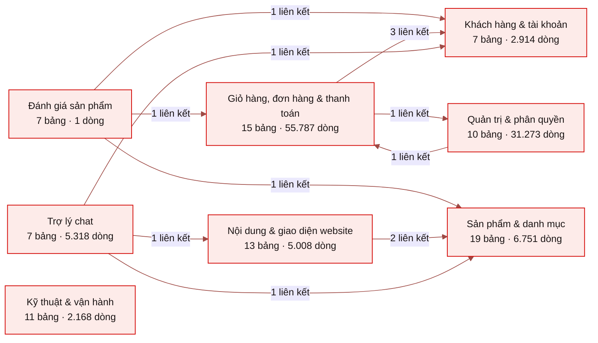
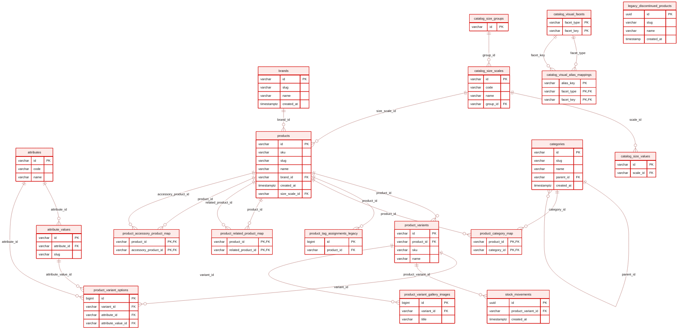
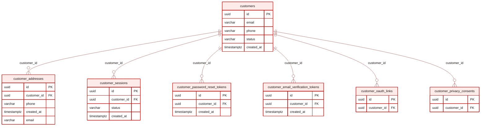
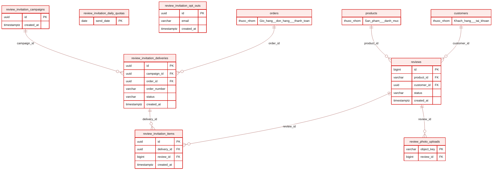
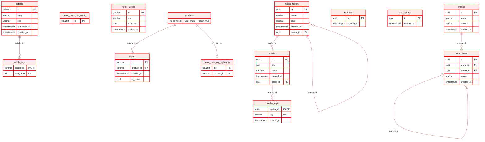
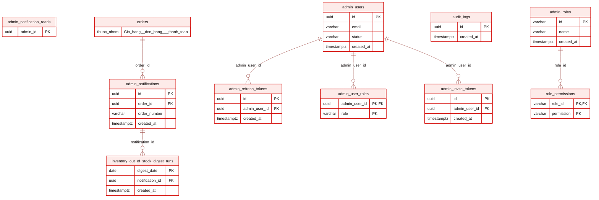
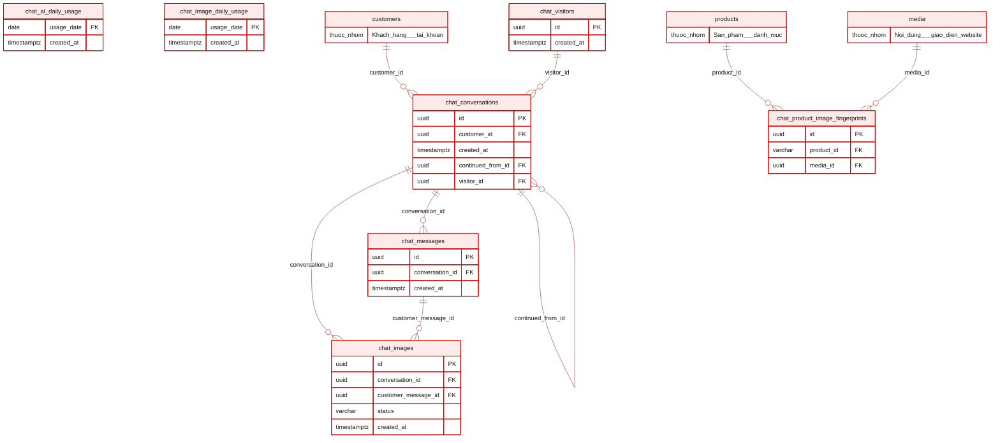
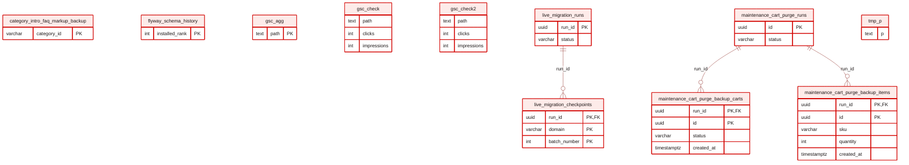

# Sơ đồ quan hệ dữ liệu (ERD) - BigBike

> File này được **sinh tự động** bằng `bash scripts/ops/export-erd.sh` từ cơ sở dữ liệu đang chạy.
> Không sửa tay. Đây là ảnh chụp hiện trạng, không phải tài liệu hợp đồng - contract nằm ở `DATA_CONTRACT.md`.
> Sinh lúc: 2026-09-05 08:39 (giờ VN)

**Tổng quan:** 89 bảng, 1000 cột, 77 liên kết khoá ngoại, 109.220 dòng dữ liệu.

## Bản đồ nhóm nghiệp vụ

## Sản phẩm & danh mục

19 bảng · 6.751 dòng.

| Bảng | Số dòng | Ghi chú |
|---|---:|---|
| `attribute_values` | 271 |  |
| `attributes` | 11 |  |
| `brands` | 26 |  |
| `catalog_size_groups` | 6 |  |
| `catalog_size_scales` | 8 |  |
| `catalog_size_values` | 87 |  |
| `catalog_visual_alias_mappings` | 158 |  |
| `catalog_visual_facets` | 16 |  |
| `categories` | 37 |  |
| `legacy_discontinued_products` | 58 |  |
| `product_accessory_product_map` | 0 |  |
| `product_category_map` | 250 |  |
| `product_related_product_map` | 1 |  |
| `product_tag_assignments_legacy` | 0 |  |
| `product_variant_gallery_images` | 2.048 |  |
| `product_variant_options` | 2.264 |  |
| `product_variants` | 1.258 |  |
| `products` | 249 |  |
| `stock_movements` | 3 |  |

## Khách hàng & tài khoản

7 bảng · 2.914 dòng.

| Bảng | Số dòng | Ghi chú |
|---|---:|---|
| `customer_addresses` | 877 |  |
| `customer_email_verification_tokens` | 3 |  |
| `customer_oauth_links` | 9 |  |
| `customer_password_reset_tokens` | 0 |  |
| `customer_privacy_consents` | 0 |  |
| `customer_sessions` | 65 |  |
| `customers` | 1.960 |  |

## Giỏ hàng, đơn hàng & thanh toán

15 bảng · 55.787 dòng.

| Bảng | Số dòng | Ghi chú |
|---|---:|---|
| `cart_items` | 46 |  |
| `carts` | 45.192 |  |
| `checkout_idempotency_keys` | 8 |  |
| `order_addresses` | 2.272 |  |
| `order_fee_items` | 0 |  |
| `order_history_batch_orders` | 1.660 |  |
| `order_history_batches` | 1 |  |
| `order_line_items` | 1.920 |  |
| `order_notes` | 3 |  |
| `order_overdue_reminder_orders` | 0 |  |
| `order_overdue_reminder_runs` | 3 |  |
| `order_shipping_items` | 1.346 |  |
| `orders` | 1.668 |  |
| `payment_events` | 0 |  |
| `payments` | 1.668 |  |

```mermaid
%%{init: {"theme":"base","themeVariables":{"fontFamily":"Inter, Segoe UI, Arial, sans-serif","fontSize":"14px","primaryColor":"#FDEBE9","primaryTextColor":"#1A1414","primaryBorderColor":"#D40A07","lineColor":"#9E4A45","textColor":"#1A1414","attributeBackgroundColorOdd":"#FFFFFF","attributeBackgroundColorEven":"#FAF5F4"},"er":{"layoutDirection":"LR","entityPadding":12,"diagramPadding":16}}}%%
erDiagram
  cart_items {
    uuid id PK
    uuid cart_id FK
    varchar sku
    int quantity
    timestamptz created_at
  }
  carts {
    uuid id PK
    uuid customer_id FK
    varchar status
    timestamptz created_at
  }
  checkout_idempotency_keys {
    uuid id PK
    uuid customer_id FK
    uuid order_id FK
    timestamptz created_at
  }
  order_addresses {
    uuid id PK
    uuid order_id FK
    varchar email
    varchar phone
    timestamptz created_at
  }
  order_fee_items {
    uuid id PK
    uuid order_id FK
    text name
    timestamptz created_at
  }
  order_history_batch_orders {
    uuid id PK
    uuid batch_id FK
    uuid order_id FK
  }
  order_history_batches {
    uuid id PK
    timestamptz created_at
  }
  order_line_items {
    uuid id PK
    uuid order_id FK
    varchar sku
    int quantity
    timestamptz created_at
  }
  order_notes {
    uuid id PK
    uuid order_id FK
    timestamptz created_at
  }
  order_overdue_reminder_orders {
    uuid order_id PK, FK
    date run_date FK
  }
  order_overdue_reminder_runs {
    date run_date PK
    uuid notification_id FK
    timestamptz created_at
  }
  order_shipping_items {
    uuid id PK
    uuid order_id FK
    timestamptz created_at
  }
  orders {
    uuid id PK
    varchar order_number
    uuid customer_id FK
    varchar status
    timestamptz created_at
  }
  payment_events {
    uuid id PK
    uuid payment_id FK
    uuid order_id FK
    varchar status
  }
  payments {
    uuid id PK
    uuid order_id FK
    varchar status
    timestamptz created_at
  }
  admin_notifications {
    thuoc_nhom Quan_tri___phan_quyen
  }
  customers {
    thuoc_nhom Khach_hang___tai_khoan
  }
  customers ||--o{ carts : "customer_id"
  carts ||--o{ cart_items : "cart_id"
  customers ||--o{ orders : "customer_id"
  orders ||--o{ order_line_items : "order_id"
  orders ||--o{ order_shipping_items : "order_id"
  orders ||--o{ order_fee_items : "order_id"
  orders ||--o{ order_addresses : "order_id"
  orders ||--o{ order_notes : "order_id"
  orders ||--o{ payments : "order_id"
  payments ||--o{ payment_events : "payment_id"
  orders ||--o{ payment_events : "order_id"
  customers ||--o{ checkout_idempotency_keys : "customer_id"
  orders ||--o{ checkout_idempotency_keys : "order_id"
  order_history_batches ||--o{ order_history_batch_orders : "batch_id"
  orders ||--o{ order_history_batch_orders : "order_id"
  admin_notifications ||--o{ order_overdue_reminder_runs : "notification_id"
  orders ||--o{ order_overdue_reminder_orders : "order_id"
  order_overdue_reminder_runs ||--o{ order_overdue_reminder_orders : "run_date"
```

## Đánh giá sản phẩm

7 bảng · 1 dòng.

| Bảng | Số dòng | Ghi chú |
|---|---:|---|
| `review_invitation_campaigns` | 1 |  |
| `review_invitation_daily_quotas` | 0 |  |
| `review_invitation_deliveries` | 0 |  |
| `review_invitation_items` | 0 |  |
| `review_invitation_opt_outs` | 0 |  |
| `review_photo_uploads` | 0 |  |
| `reviews` | 0 |  |

## Nội dung & giao diện website

13 bảng · 5.008 dòng.

| Bảng | Số dòng | Ghi chú |
|---|---:|---|
| `article_tags` | 22 |  |
| `articles` | 185 |  |
| `home_category_highlights` | 3 |  |
| `home_highlights_config` | 1 |  |
| `home_videos` | 74 |  |
| `media` | 3.733 |  |
| `media_folders` | 34 |  |
| `media_tags` | 0 |  |
| `menu_items` | 75 |  |
| `menus` | 3 |  |
| `redirects` | 814 |  |
| `site_settings` | 59 |  |
| `sliders` | 5 |  |

## Quản trị & phân quyền

10 bảng · 31.273 dòng.

| Bảng | Số dòng | Ghi chú |
|---|---:|---|
| `admin_invite_tokens` | 2 |  |
| `admin_notification_reads` | 3 |  |
| `admin_notifications` | 11 |  |
| `admin_refresh_tokens` | 4.411 |  |
| `admin_roles` | 4 |  |
| `admin_user_roles` | 0 |  |
| `admin_users` | 6 |  |
| `audit_logs` | 26.765 |  |
| `inventory_out_of_stock_digest_runs` | 6 |  |
| `role_permissions` | 65 |  |

## Trợ lý chat

7 bảng · 5.318 dòng.

| Bảng | Số dòng | Ghi chú |
|---|---:|---|
| `chat_ai_daily_usage` | 1 |  |
| `chat_conversations` | 3 |  |
| `chat_image_daily_usage` | 0 |  |
| `chat_images` | 0 |  |
| `chat_messages` | 3 |  |
| `chat_product_image_fingerprints` | 0 |  |
| `chat_visitors` | 5.311 |  |

## Kỹ thuật & vận hành

11 bảng · 2.168 dòng.

| Bảng | Số dòng | Ghi chú |
|---|---:|---|
| `category_intro_faq_markup_backup` | 27 | ⚠️ bảng tạm/backup |
| `flyway_schema_history` | 453 |  |
| `gsc_agg` | 657 | ⚠️ bảng tạm/backup |
| `gsc_check` | 118 | ⚠️ bảng tạm/backup |
| `gsc_check2` | 231 | ⚠️ bảng tạm/backup |
| `live_migration_checkpoints` | 134 |  |
| `live_migration_runs` | 1 |  |
| `maintenance_cart_purge_backup_carts` | 0 | ⚠️ bảng tạm/backup |
| `maintenance_cart_purge_backup_items` | 0 | ⚠️ bảng tạm/backup |
| `maintenance_cart_purge_runs` | 0 |  |
| `tmp_p` | 547 | ⚠️ bảng tạm/backup |

## Liên kết ngầm (không có ràng buộc khoá ngoại trong CSDL)

Các cột dưới đây trỏ tới bảng khác theo quy ước đặt tên nhưng **không** được cơ sở dữ liệu ràng buộc,
nên không hiện thành mũi tên trong sơ đồ. Dữ liệu mồ côi ở đây sẽ không bị chặn tự động.

| Bảng | Cột |
|---|---|
| `admin_notification_reads` | `admin_id` |
| `articles` | `cover_image_id` |
| `articles` | `seo_og_image_id` |
| `audit_logs` | `actor_id` |
| `audit_logs` | `resource_id` |
| `brands` | `logo_id` |
| `brands` | `seo_og_image_id` |
| `cart_items` | `product_id` |
| `cart_items` | `product_variant_id` |
| `cart_items` | `product_image_id` |
| `carts` | `session_id` |
| `categories` | `image_id` |
| `categories` | `icon_id` |
| `categories` | `seo_og_image_id` |
| `category_intro_faq_markup_backup` | `category_id` |
| `chat_conversations` | `thread_id` |
| `chat_images` | `request_id` |
| `chat_messages` | `request_id` |
| `checkout_idempotency_keys` | `guest_session_id` |
| `home_videos` | `youtube_id` |
| `live_migration_runs` | `run_id` |
| `live_migration_runs` | `snapshot_id` |
| `maintenance_cart_purge_backup_carts` | `customer_id` |
| `maintenance_cart_purge_backup_carts` | `session_id` |
| `maintenance_cart_purge_backup_items` | `cart_id` |
| `maintenance_cart_purge_backup_items` | `product_id` |
| `maintenance_cart_purge_backup_items` | `product_variant_id` |
| `maintenance_cart_purge_backup_items` | `product_image_id` |
| `menu_items` | `target_id` |
| `order_line_items` | `product_id` |
| `order_line_items` | `product_variant_id` |
| `order_notes` | `author_id` |
| `orders` | `created_by_admin_id` |
| `payment_events` | `event_id` |
| `payments` | `transaction_id` |
| `product_variant_gallery_images` | `image_id` |
| `product_variant_gallery_images` | `video_id` |
| `product_variants` | `image_id` |
| `products` | `image_id` |
| `products` | `seo_og_image_id` |
| `review_invitation_deliveries` | `customer_id` |
| `review_invitation_items` | `product_id` |
| `review_photo_uploads` | `product_id` |
| `stock_movements` | `reference_id` |
| `stock_movements` | `admin_id` |
| `stock_movements` | `product_id` |
