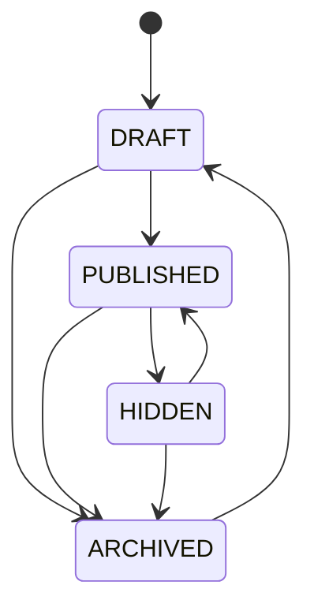
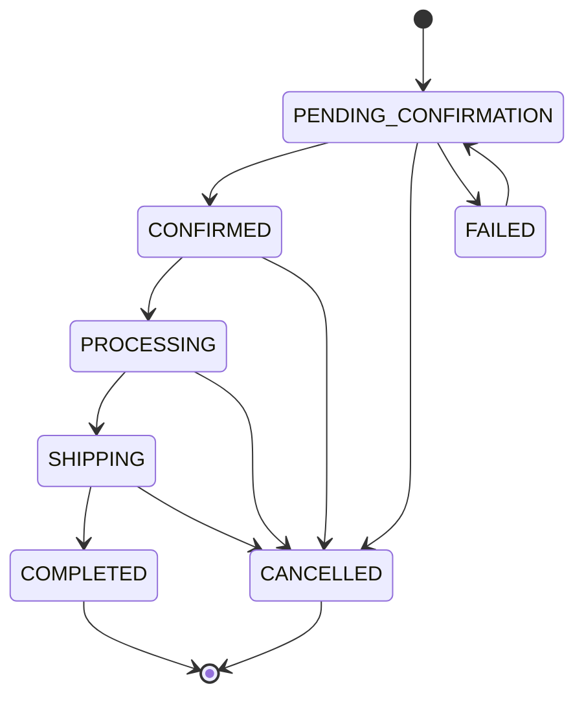
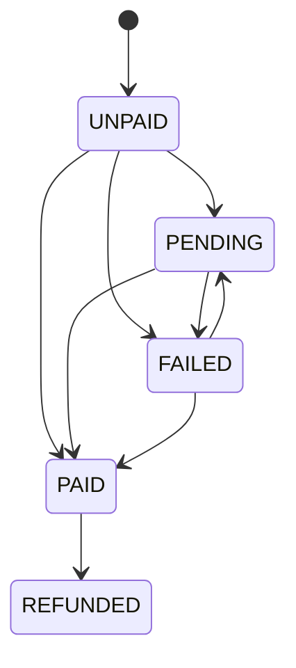

# STATE_MACHINES.md

> State machine contract cho BigBike.
>
> File này định nghĩa trạng thái và transition hợp lệ cho các domain chính: product publish, order, payment, fulfillment, content, campaign, contact/support.
>
> File này không định nghĩa UI layout, API endpoint hay database schema. Nó chỉ trả lời câu hỏi: trạng thái nào được chuyển sang trạng thái nào. Thế thôi. Rất khiêm tốn, điều mà nhiều tài liệu khác nên học hỏi.

---

## 1. Purpose

`STATE_MACHINES.md` là nguồn chuẩn cho status transition trong BigBike.

File này dùng để:

- Backend validate transition.
- Frontend biết action nào nên enable/disable.
- Admin không chuyển trạng thái sai.
- QA biết test happy path và invalid transition.
- AI agent không tự phát minh status.

File này liên quan trực tiếp đến:

- `DATA_CONTRACT.md`
- `API_CONTRACT.md`
- `BUSINESS_RULES.md`
- `WORKFLOW.md`

---

## 2. General Rules

### 2.1 Backend enforcement

Backend phải enforce state transition.

Frontend chỉ hỗ trợ UX:

- Hide/disable invalid action.
- Show confirmation.
- Render status label.
- Show error when backend rejects transition.

### 2.2 Invalid transition

Invalid transition should return:

```http
409 Conflict
```

Error code:

```text
INVALID_STATE_TRANSITION
```

Example:

```json
{
  "error": {
    "code": "INVALID_STATE_TRANSITION",
    "message": "Order cannot move from COMPLETED to PENDING_CONFIRMATION."
  }
}
```

### 2.3 Unknown state

Frontend must not crash on unknown state.

Render fallback neutral status and report/log if needed.

### 2.4 Audit

State transitions should be auditable for important domains:

- Order.
- Payment.
- Product publish.
- Content publish.
- Campaign status.
- Support ticket.

Audit fields may include:

- actorId.
- fromStatus.
- toStatus.
- reason.
- note.
- timestamp.

---

## 3. Product Publish State Machine

### 3.1 States

```text
DRAFT
PUBLISHED
HIDDEN
ARCHIVED
```

### 3.2 Meaning

| State | Meaning |
|---|---|
| `DRAFT` | Product is being prepared, not visible public |
| `PUBLISHED` | Product visible on public website |
| `HIDDEN` | Product exists but hidden from public listing |
| `ARCHIVED` | Product retired/archived, not sellable |

### 3.3 Allowed transitions

```text
DRAFT -> PUBLISHED
DRAFT -> ARCHIVED

PUBLISHED -> HIDDEN
PUBLISHED -> ARCHIVED

HIDDEN -> PUBLISHED
HIDDEN -> ARCHIVED

ARCHIVED -> DRAFT
```

### 3.4 Transition notes

- Publish requires required product fields.
- Archived product should not be sellable.
- Restoring archived product should usually go to `DRAFT`, not directly public.
- Public website normally shows only `PUBLISHED`.

### 3.5 Mermaid



---

## 4. Product Stock State Machine

### 4.1 States

```text
IN_STOCK
LOW_STOCK
OUT_OF_STOCK
PREORDER
CONTACT_FOR_STOCK
```

### 4.2 Meaning

| State | Meaning |
|---|---|
| `IN_STOCK` | Product can be purchased normally |
| `LOW_STOCK` | Product available but limited |
| `OUT_OF_STOCK` | Product unavailable for normal purchase |
| `PREORDER` | Product can be ordered before available if business supports |
| `CONTACT_FOR_STOCK` | Customer should contact shop to confirm availability |

### 4.3 Allowed transitions

Stock transitions depend on inventory implementation.

General allowed transitions:

```text
IN_STOCK -> LOW_STOCK
IN_STOCK -> OUT_OF_STOCK
IN_STOCK -> CONTACT_FOR_STOCK

LOW_STOCK -> IN_STOCK
LOW_STOCK -> OUT_OF_STOCK
LOW_STOCK -> CONTACT_FOR_STOCK

OUT_OF_STOCK -> IN_STOCK
OUT_OF_STOCK -> PREORDER
OUT_OF_STOCK -> CONTACT_FOR_STOCK

PREORDER -> IN_STOCK
PREORDER -> OUT_OF_STOCK
PREORDER -> CONTACT_FOR_STOCK

CONTACT_FOR_STOCK -> IN_STOCK
CONTACT_FOR_STOCK -> OUT_OF_STOCK
CONTACT_FOR_STOCK -> PREORDER
```

### 4.4 Purchase behavior

| State | Public purchase |
|---|---|
| `IN_STOCK` | Allowed |
| `LOW_STOCK` | Allowed with clear label |
| `OUT_OF_STOCK` | Not allowed unless business overrides |
| `PREORDER` | Allowed only if preorder is supported |
| `CONTACT_FOR_STOCK` | Usually contact-first |

---

## 5. Order State Machine

### 5.1 States

```text
PENDING_CONFIRMATION
CONFIRMED
PROCESSING
SHIPPING
COMPLETED
CANCELLED
FAILED
```

### 5.2 Meaning

| State | Meaning |
|---|---|
| `PENDING_CONFIRMATION` | Order submitted, waiting shop/admin confirmation |
| `CONFIRMED` | Order confirmed |
| `PROCESSING` | Order being prepared |
| `SHIPPING` | Order is shipping/delivery in progress |
| `COMPLETED` | Order completed |
| `CANCELLED` | Order cancelled |
| `FAILED` | Order failed due to system/payment/validation issue |

### 5.3 Allowed transitions

```text
PENDING_CONFIRMATION -> CONFIRMED
PENDING_CONFIRMATION -> CANCELLED
PENDING_CONFIRMATION -> FAILED

CONFIRMED -> PROCESSING
CONFIRMED -> CANCELLED

PROCESSING -> SHIPPING
PROCESSING -> CANCELLED

SHIPPING -> COMPLETED
SHIPPING -> CANCELLED

FAILED -> PENDING_CONFIRMATION
```

### 5.4 Terminal states

Terminal by default:

```text
COMPLETED
CANCELLED
```

`FAILED` may be recoverable to `PENDING_CONFIRMATION` only if business supports retry/manual recovery.

### 5.5 Forbidden examples

```text
COMPLETED -> PENDING_CONFIRMATION
CANCELLED -> SHIPPING
PENDING_CONFIRMATION -> COMPLETED
SHIPPING -> PROCESSING
```

### 5.6 Mermaid



---

## 6. Payment State Machine

### 6.1 States

```text
UNPAID
PENDING
PAID
FAILED
REFUNDED
```

### 6.2 Meaning

| State | Meaning |
|---|---|
| `UNPAID` | No payment received/required yet |
| `PENDING` | Payment pending confirmation |
| `PAID` | Payment confirmed |
| `FAILED` | Payment failed |
| `REFUNDED` | Payment refunded |

### 6.3 Allowed transitions

```text
UNPAID -> PENDING
UNPAID -> PAID
UNPAID -> FAILED

PENDING -> PAID
PENDING -> FAILED

FAILED -> PENDING
FAILED -> PAID

PAID -> REFUNDED
```

### 6.4 Notes

- COD orders may remain `UNPAID` until delivery/confirmation depending business.
- Bank transfer may move `PENDING -> PAID` after admin/system confirmation.
- `REFUNDED` requires business/payment process support.
- Payment state is separate from order state.

### 6.5 Mermaid



---

## 7. Fulfillment State Machine

### 7.1 States

```text
NOT_FULFILLED
PREPARING
PARTIALLY_FULFILLED
FULFILLED
RETURNED
```

### 7.2 Allowed transitions

```text
NOT_FULFILLED -> PREPARING
PREPARING -> PARTIALLY_FULFILLED
PREPARING -> FULFILLED
PARTIALLY_FULFILLED -> FULFILLED
FULFILLED -> RETURNED
```

### 7.3 Notes

- Fulfillment may be optional in early implementation.
- If not implemented, order status may carry operational flow.
- Do not invent fulfillment state in frontend if backend does not support it.

---

## 8. Content Publish State Machine

### 8.1 States

```text
DRAFT
PUBLISHED
HIDDEN
ARCHIVED
```

Same as publish status.

### 8.2 Allowed transitions

```text
DRAFT -> PUBLISHED
DRAFT -> ARCHIVED

PUBLISHED -> HIDDEN
PUBLISHED -> ARCHIVED

HIDDEN -> PUBLISHED
HIDDEN -> ARCHIVED

ARCHIVED -> DRAFT
```

### 8.3 Notes

- Public website shows only `PUBLISHED`.
- `HIDDEN` may be accessible only if route/preview supports it.
- Preview should not be treated as publish.

---

## 9. Campaign State Machine

### 9.1 States

```text
DRAFT
SCHEDULED
ACTIVE
EXPIRED
DISABLED
```

### 9.2 Meaning

| State | Meaning |
|---|---|
| `DRAFT` | Being prepared |
| `SCHEDULED` | Ready for future start |
| `ACTIVE` | Currently active |
| `EXPIRED` | Ended by time |
| `DISABLED` | Manually disabled |

### 9.3 Allowed transitions

```text
DRAFT -> SCHEDULED
DRAFT -> ACTIVE
DRAFT -> DISABLED

SCHEDULED -> ACTIVE
SCHEDULED -> DISABLED

ACTIVE -> EXPIRED
ACTIVE -> DISABLED

EXPIRED -> DRAFT
DISABLED -> DRAFT
```

### 9.4 Notes

- Scheduled/expired may be computed by time.
- Manual disable should override public visibility.
- Banner/product badge must not show inactive campaign.

---

## 10. Contact Request State Machine

### 10.1 States

```text
RECEIVED
IN_PROGRESS
RESOLVED
SPAM
CLOSED
```

### 10.2 Allowed transitions

```text
RECEIVED -> IN_PROGRESS
RECEIVED -> SPAM
RECEIVED -> CLOSED

IN_PROGRESS -> RESOLVED
IN_PROGRESS -> CLOSED
IN_PROGRESS -> SPAM

RESOLVED -> CLOSED
SPAM -> CLOSED
```

### 10.3 Notes

- `SPAM` should hide from normal queues.
- `CLOSED` is terminal unless reopen is supported.
- If reopen is needed, add transition explicitly.

---

## 11. Customer Status State Machine

### 11.1 States

```text
ACTIVE
DISABLED
ARCHIVED
```

### 11.2 Allowed transitions

```text
ACTIVE -> DISABLED
ACTIVE -> ARCHIVED

DISABLED -> ACTIVE
DISABLED -> ARCHIVED

ARCHIVED -> ACTIVE
```

### 11.3 Notes

- Archived customer restore should require permission.
- Do not expose sensitive customer data without permission.

---

## 12. Admin User Status State Machine

### 12.1 States

```text
ACTIVE
DISABLED
```

### 12.2 Allowed transitions

```text
ACTIVE -> DISABLED
DISABLED -> ACTIVE
```

### 12.3 Notes

- Cannot disable last super admin if system has super admin concept.
- Disabled user cannot access admin API.

---

## 13. Warranty / Return Request Concept State Machine

Only use if module exists.

### 13.1 States

```text
NEW
NEEDS_INFORMATION
UNDER_REVIEW
APPROVED
REJECTED
COMPLETED
CANCELLED
```

### 13.2 Allowed transitions

```text
NEW -> NEEDS_INFORMATION
NEW -> UNDER_REVIEW
NEW -> CANCELLED

NEEDS_INFORMATION -> UNDER_REVIEW
NEEDS_INFORMATION -> CANCELLED

UNDER_REVIEW -> APPROVED
UNDER_REVIEW -> REJECTED
UNDER_REVIEW -> NEEDS_INFORMATION

APPROVED -> COMPLETED
APPROVED -> CANCELLED

REJECTED -> CLOSED
```

If `CLOSED` is needed, add it to data contract first. Do not half-add states like a civilized chaos goblin.

---

## 14. Transition API Contract

State-changing endpoints should use command style when transition has side effects.

Examples:

```http
POST /api/v1/admin/orders/{orderId}/status
POST /api/v1/admin/orders/{orderId}/cancel
POST /api/v1/admin/products/{productId}/publish
POST /api/v1/admin/products/{productId}/unpublish
```

Request should include:

```json
{
  "status": "CONFIRMED",
  "reason": "Customer confirmed by phone",
  "note": "Called at 10:30"
}
```

Response should return updated resource or transition result.

---

## 15. Frontend Rules

Frontend must:

- Render status label by enum.
- Use neutral fallback for unknown enum.
- Disable invalid actions where known.
- Still handle backend rejection.
- Show clear error on invalid transition.
- Not invent local-only state unless it is pure UI state.

---

## 16. Backend Rules

Backend must:

- Validate transition.
- Validate permission.
- Record audit where required.
- Reject invalid transition.
- Prevent race conditions where possible.
- Keep payment/order/fulfillment state separate if implemented.

---

## 17. AI Agent Rules

1. Do not add status in code without updating this file and `DATA_CONTRACT.md`.
2. Do not allow impossible transition just because UI button exists.
3. Do not use display labels as enum values.
4. Do not mix payment state with order state.
5. Do not use color as status definition.
6. Do not silently map unknown state to success.
7. Do not make terminal state mutable unless business confirms.
8. Update tests when transitions change.

---

## 18. Review Checklist

- [ ] Every status exists in `DATA_CONTRACT.md`.
- [ ] Every transition is listed here.
- [ ] Backend rejects invalid transition.
- [ ] Frontend handles rejection.
- [ ] Admin action permission checked.
- [ ] Terminal states are clear.
- [ ] Unknown state fallback exists.
- [ ] State-changing API uses proper method.
- [ ] Audit/history considered for critical transitions.
