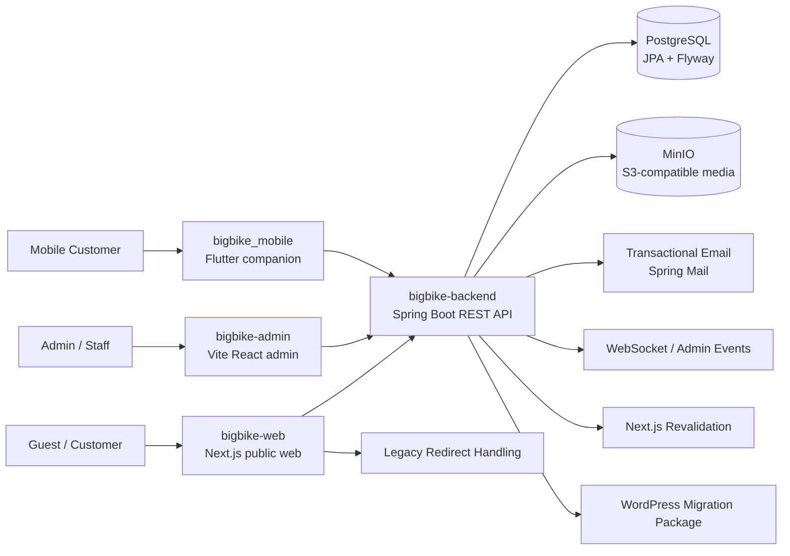
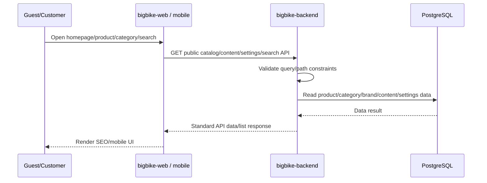
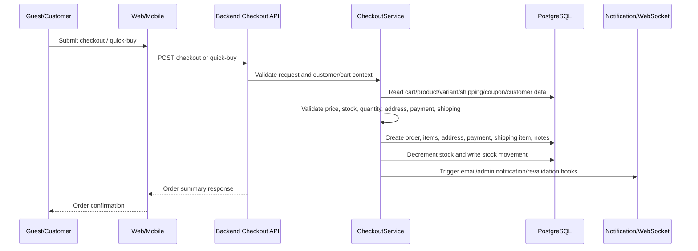
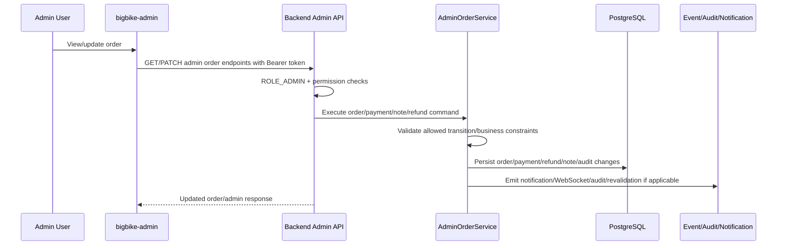
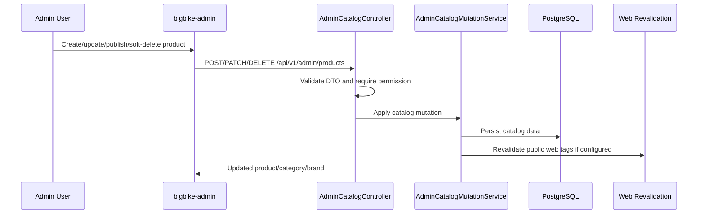

# BigBike Architecture

## 1. Document Purpose

File này mô tả kiến trúc kỹ thuật tổng thể của BigBike để developer mới, PM kỹ thuật, tester, DevOps và AI agent hiểu hệ thống được thiết kế như thế nào.

Tài liệu này trả lời câu hỏi: **"Hệ thống được thiết kế kỹ thuật như thế nào?"**

Tài liệu này dùng để:

- Hiểu các app/service/layer/integration/deployment chính.
- Hiểu request đi qua những layer nào.
- Hiểu dữ liệu được lưu ở đâu và được truy cập bằng layer nào.
- Hiểu business rule nên được enforce ở backend/service layer, không đẩy sang frontend như một canh bạc UX.
- Tránh AI agent sửa nhầm layer, bịa service, bịa queue hoặc nhét business rule vào UI rồi gọi là architecture.

Giới hạn:

- Không phải `PROJECT_OVERVIEW.md`.
- Không phải `BUSINESS_PROCESS.md`.
- Không phải `MODULE_CATALOG.md`.
- Không phải `API_CONTRACT.md`.
- Không phải `DATA_CONTRACT.md`.
- Không nhồi request/response detail.
- Không nhồi database schema chi tiết.
- Không chứa secret, token, password, private key hoặc env value nhạy cảm.
- Không khẳng định production-ready nếu chưa có build/test/runtime evidence mới nhất.

## 2. Architecture Status Labels

| Label | Meaning |
|---|---|
| `CONFIRMED_FROM_CODE` | Đã thấy evidence trực tiếp trong source/config/docs hiện có. |
| `INFERRED_FROM_STRUCTURE` | Suy luận hợp lý từ folder, route, package, dependency, naming hoặc config, nhưng chưa đủ evidence để kết luận hoàn chỉnh. |
| `DOCUMENTED_NOT_ENFORCED` | Tài liệu nói có rule/behavior nhưng chưa thấy code/config enforce rõ ràng. |
| `NEEDS_VERIFICATION` | Cần kiểm tra thêm bằng code audit sâu hơn, fresh build/test/runtime hoặc xác nhận business. |
| `NOT_FOUND_IN_REPO` | Không thấy evidence trong repo qua audit hiện tại. |
| `CONFLICTING_EVIDENCE` | Có bằng chứng mâu thuẫn giữa docs/source/config. |

## 3. System Overview

BigBike là một retail / D2C commerce platform cho motorcycle gear, biker accessories và touring equipment. Repo hiện tại thể hiện kiến trúc monorepo gồm public SEO-first website, admin dashboard, Spring Boot backend, Flutter mobile companion, Docker Compose runtime, PostgreSQL database, MinIO media storage và design system.

Các actor chính:

- Guest / Customer: truy cập public web/mobile, browse sản phẩm, xem content, dùng cart/checkout, login/register/account/orders.
- Admin / Staff: vận hành catalog, orders, customers, inventory, media, content, settings, menus, coupons, shipping, reports, roles/permissions.
- System actor: backend service, database, object storage, email, websocket/revalidation/internal jobs.
- AI agent / developer: đọc docs/source để implement đúng layer, tránh sáng tác nghiệp vụ bằng cảm hứng nghệ thuật gây cháy production.

| Component | Purpose | Tech / Runtime | Status | Evidence |
|---|---|---|---|---|
| `bigbike-web` | Public SEO-first commerce website cho customer. | Next.js 16.2.4, React 19.2.4, TypeScript, Tailwind CSS 4, Node.js. | `CONFIRMED_FROM_CODE` | `README.md`, `bigbike-web/package.json`, `bigbike-web/app/page.tsx`, `bigbike-web/lib/utils/routes.ts`, `docker-compose.yaml` |
| `bigbike-admin` | Internal admin dashboard cho vận hành. | Vite 8.0.4, React 19.2.4, JavaScript, nginx static serving in Docker. | `CONFIRMED_FROM_CODE` | `README.md`, `bigbike-admin/package.json`, `bigbike-admin/README.md`, `bigbike-admin/src/lib/adminApi.js`, `docker-compose.yaml` |
| `bigbike-backend` | Backend REST API, business validation, persistence, auth/RBAC, integrations. | Spring Boot 4.0.5, Java 17, Maven, Spring MVC, Security, JPA, Flyway. | `CONFIRMED_FROM_CODE` | `README.md`, `bigbike-backend/pom.xml`, `bigbike-backend/src/main/java/com/bigbike/bigbike_backend/**`, `bigbike-backend/src/main/resources/application.properties` |
| `bigbike_mobile` | Flutter mobile companion cho commerce/account flows. | Flutter, Riverpod, GoRouter, Dio, secure storage. | `CONFIRMED_FROM_CODE`; production scope `NEEDS_VERIFICATION` | `bigbike_mobile/pubspec.yaml`, `bigbike_mobile/lib/core/router/app_router.dart` |
| PostgreSQL | Primary relational database. | `postgres:16-alpine`, JPA, Flyway migrations. | `CONFIRMED_FROM_CODE` | `docker-compose.yaml`, `bigbike-backend/pom.xml`, `bigbike-backend/src/main/resources/db/migration/**` |
| MinIO | S3-compatible object storage cho media. | `minio/minio`, MinIO Java SDK. | `CONFIRMED_FROM_CODE` | `docker-compose.yaml`, `bigbike-backend/pom.xml`, `bigbike-backend/src/main/java/com/bigbike/bigbike_backend/config/MinioConfig.java`, `MinioProperties.java` |
| Email / notification | Transactional email và admin/customer notification hooks. | Spring Mail, templates/config, service usage. | `CONFIRMED_FROM_CODE` for code/config; runtime deliverability `NEEDS_VERIFICATION` | `bigbike-backend/pom.xml`, `bigbike-backend/src/main/resources/application.properties`, `docker-compose.yaml`, `OrderNotificationService` |
| WebSocket / realtime admin events | Realtime admin notifications/events. | Spring WebSocket/STOMP. | `CONFIRMED_FROM_CODE`; full channel contract `NEEDS_VERIFICATION` | `bigbike-backend/pom.xml`, `SecurityConfig.java`, `AdminOrderWsService` |
| Design System | Visual/brand source of truth. | CSS tokens, fonts, assets, UI kit. | `CONFIRMED_FROM_CODE` | `Bigbike Design System/README.md`, `Bigbike Design System/colors_and_type.css`, `README.md`, `AGENTS.md` |
| WordPress migration / redirect tooling | Legacy WordPress/WooCommerce migration and URL compatibility. | Backend migration package, web ETL scripts, redirect endpoints/data. | `CONFIRMED_FROM_CODE`; coverage `NEEDS_VERIFICATION` | `README.md`, `bigbike-web/package.json`, `bigbike-backend/src/main/java/com/bigbike/bigbike_backend/migration/wordpress/**`, `InternalRedirectController` |
| External payment gateway | Online payment provider/webhook integration. | Not confirmed. | `NOT_FOUND_IN_REPO` | No confirmed payment webhook/provider controller/service found in audited evidence. |
| External shipping carrier | GHN/GHTK/ViettelPost/carrier integration. | Not confirmed. | `NOT_FOUND_IN_REPO` | `AdminShippingController` confirms internal shipping zones/methods only; no provider-specific evidence found. |

## 4. High-Level Architecture Diagram

Status: `CONFIRMED_FROM_CODE` cho web/admin/backend/mobile/PostgreSQL/MinIO/mail config/WebSocket dependency/revalidation config/migration package. `NEEDS_VERIFICATION` cho runtime success của email, realtime event contract, full redirect coverage và production health.

Evidence:

- `docker-compose.yaml`
- `README.md`
- `bigbike-web/package.json`
- `bigbike-admin/package.json`
- `bigbike-backend/pom.xml`
- `bigbike_mobile/pubspec.yaml`
- `bigbike-backend/src/main/resources/application.properties`

## 5. Repository and Application Boundaries

| Path | Boundary | Responsibilities | Must Not Own | Status | Evidence |
|---|---|---|---|---|---|
| `bigbike-web/` | Public storefront boundary. | SEO, homepage, product/category/brand/content pages, cart/checkout UI, customer-facing routes, public API consumption, metadata/JSON-LD, redirect behavior. | Admin permission enforcement, final price/stock validation, order/payment state transition enforcement. | `CONFIRMED_FROM_CODE` | `README.md`, `bigbike-web/package.json`, `bigbike-web/app/page.tsx`, `bigbike-web/lib/utils/routes.ts` |
| `bigbike-admin/` | Internal operations UI boundary. | Admin tables/forms/routes, permission-aware UI, admin API client, dashboard/catalog/orders/customers/media/content/settings/coupons/shipping/reports screens. | Security source of truth, business rule enforcement, database writes without backend validation. | `CONFIRMED_FROM_CODE` | `bigbike-admin/README.md`, `bigbike-admin/package.json`, `bigbike-admin/src/lib/adminApi.js` |
| `bigbike-backend/` | Business/API/data/security boundary. | REST APIs, validation, auth, RBAC, state transitions, persistence, stock/order/payment/checkout/media logic, integrations. | Public UI rendering, admin SPA routing, design token ownership. | `CONFIRMED_FROM_CODE` | `bigbike-backend/pom.xml`, `SecurityConfig.java`, backend `api/**`, `service/**`, `persistence/**` |
| `bigbike_mobile/` | Mobile companion boundary. | Mobile routes for home/products/cart/checkout/auth/account/orders/returns/search/articles/contact/content. | Backend rule enforcement, admin operations unless explicitly implemented later. | `CONFIRMED_FROM_CODE`; production scope `NEEDS_VERIFICATION` | `bigbike_mobile/pubspec.yaml`, `bigbike_mobile/lib/core/router/app_router.dart` |
| `Bigbike Design System/` | Brand/design source-of-truth boundary. | Brand context, colors, typography, logos, icons, UI kit/prototype references. | Runtime business behavior, API contracts, production data contracts. | `CONFIRMED_FROM_CODE` | `Bigbike Design System/README.md`, `Bigbike Design System/colors_and_type.css` |
| `docs/business/` | Business documentation boundary. | Project overview, business process, module catalog, roles, workflows, rules, state machines, acceptance criteria. | Technical runtime architecture detail. | `CONFIRMED_FROM_CODE` for existing files found; some requested docs may need verification. | `docs/business/PROJECT_OVERVIEW.md`, `BUSINESS_PROCESS.md`, `MODULE_CATALOG.md`, `WORKFLOW_OVERVIEW.md` |
| `docs/engineering/ARCHITECTURE.md` | Technical architecture boundary. | This file. Explains app/service/layer/runtime/integration/deployment shape. | API request/response detail, full DB schema, deep business rules. | `CONFIRMED_FROM_CODE` after creation. | `docs/engineering/ARCHITECTURE.md` |

## 6. Frontend Architecture

### 6.1 Public Web: `bigbike-web`

`bigbike-web` is a public storefront built with Next.js App Router. It owns SEO-facing pages, customer routes, public API consumption and public UX.

| Concern | Architecture | Status | Evidence |
|---|---|---|---|
| Framework/runtime | Next.js 16.2.4 + React 19.2.4 + TypeScript. | `CONFIRMED_FROM_CODE` | `bigbike-web/package.json` |
| Rendering model | App Router with server components/ISR-style homepage revalidation. Homepage exports `revalidate = 3600`. | `CONFIRMED_FROM_CODE` | `bigbike-web/app/page.tsx` |
| Public data fetching | Homepage calls public API functions for sliders, categories, articles, brands, settings, products and home videos. | `CONFIRMED_FROM_CODE` | `bigbike-web/app/page.tsx`, `bigbike-web/lib/api/public-api` |
| SEO metadata | Homepage uses metadata builder, canonical route helpers and JSON-LD builders. | `CONFIRMED_FROM_CODE` | `bigbike-web/app/page.tsx`, `bigbike-web/lib/seo/**`, `bigbike-web/lib/utils/routes.ts` |
| Routes | Vietnamese customer-facing routes for products, categories, brands, articles, cart, checkout, account, login/register/password reset/order confirmation. | `CONFIRMED_FROM_CODE` | `bigbike-web/lib/utils/routes.ts` |
| API contracts | Public contracts are imported from `@/lib/contracts/public`. | `CONFIRMED_FROM_CODE` | `bigbike-web/app/page.tsx`, `bigbike-web/lib/contracts/**` |
| Client state/data | React Query dependency exists. | `INFERRED_FROM_STRUCTURE` | `bigbike-web/package.json` |
| Validation/forms | `zod`, `react-hook-form`, `@hookform/resolvers` dependencies exist. | `INFERRED_FROM_STRUCTURE` | `bigbike-web/package.json` |
| Analytics/observability | Sentry dependency and GTM/Sentry env config exist; homepage imports `HomeAnalytics`. | `INFERRED_FROM_STRUCTURE`; runtime config `NEEDS_VERIFICATION` | `bigbike-web/package.json`, `bigbike-web/app/page.tsx`, `docker-compose.yaml` |
| Tests/scripts | `lint`, `test`, `test:coverage`, `build` scripts exist. | `CONFIRMED_FROM_CODE`; not run in this audit | `bigbike-web/package.json` |
| WordPress ETL | ETL scripts for extracting/loading legacy WordPress data exist. | `CONFIRMED_FROM_CODE` | `bigbike-web/package.json`, `bigbike-web/scripts/extract-wp-data/**` |

Architecture rule:

- `bigbike-web` may improve UX validation and hide invalid actions.
- `bigbike-web` must not be the source of truth for price, stock, payment status, order status, permission or publish-state enforcement.
- Public SEO route changes must update redirect strategy/data. Humanity does enjoy breaking indexed URLs and calling it “migration”; this repo explicitly should not.

### 6.2 Admin: `bigbike-admin`

`bigbike-admin` is an internal React SPA for operational workflows. It is served behind nginx in Docker and talks to backend through `/api/v1`.

| Concern | Architecture | Status | Evidence |
|---|---|---|---|
| Framework/runtime | Vite 8.0.4 + React 19.2.4 JavaScript SPA. | `CONFIRMED_FROM_CODE` | `bigbike-admin/package.json`, `README.md` |
| Admin API client | `src/lib/adminApi.js` wraps fetch, auth header injection, token refresh, live/mock fallback, error normalization and module-specific functions. | `CONFIRMED_FROM_CODE` | `bigbike-admin/src/lib/adminApi.js` |
| Auth flow | Admin login stores access/refresh token client-side and uses refresh endpoint with cookie support. | `CONFIRMED_FROM_CODE` | `bigbike-admin/src/lib/adminApi.js` |
| Mock mode | `VITE_USE_ADMIN_MOCK` can force mock data; dev live failure can fallback to mock. | `CONFIRMED_FROM_CODE`; production risk if misconfigured `NEEDS_VERIFICATION` | `bigbike-admin/src/lib/adminApi.js`, `docker-compose.yaml` |
| Modules | Products, categories, brands, content, redirects, orders, customers, media, coupons, settings, shipping, reviews, reports and more are represented in client API/mock/query layer. | `CONFIRMED_FROM_CODE` | `bigbike-admin/src/lib/adminApi.js`, `bigbike-admin/README.md` |
| Permission-aware UI | Admin README maps routes/actions to permissions. | `CONFIRMED_FROM_CODE`; full backend parity `NEEDS_VERIFICATION` | `bigbike-admin/README.md`, `SecurityConfig.java`, `DevAdminAuthService` |
| Rich content/editing | TipTap dependencies exist. | `INFERRED_FROM_STRUCTURE` | `bigbike-admin/package.json` |
| Reports/export | Recharts and xlsx dependencies exist; backend report controllers exist. | `INFERRED_FROM_STRUCTURE` for UI; backend `CONFIRMED_FROM_CODE` | `bigbike-admin/package.json`, `AdminReportController` |
| Tests/scripts | `build`, `lint`, `preview`, `dev` scripts exist; no `test` script in package evidence. | `CONFIRMED_FROM_CODE` | `bigbike-admin/package.json` |
| Deployment serving | Docker builds Vite app and serves via nginx on container port 80 mapped to host 4000. | `CONFIRMED_FROM_CODE` | `docker-compose.yaml`, `bigbike-admin/nginx.conf` |

Architecture rule:

- Admin UI may hide/disable forbidden actions.
- Backend must still enforce permissions and state transitions. Hiding a button is not security; it is merely cosmetics with a superiority complex.

### 6.3 Mobile: `bigbike_mobile`

`bigbike_mobile` is a Flutter companion app. It mirrors core commerce/customer routes.

| Concern | Architecture | Status | Evidence |
|---|---|---|---|
| Framework/runtime | Flutter app, Dart SDK `^3.11.4`. | `CONFIRMED_FROM_CODE` | `bigbike_mobile/pubspec.yaml` |
| State management | Riverpod/hooks Riverpod. | `CONFIRMED_FROM_CODE` | `bigbike_mobile/pubspec.yaml` |
| Routing | GoRouter with home/products/cart/account shell and standalone detail/auth/checkout/content routes. | `CONFIRMED_FROM_CODE` | `bigbike_mobile/lib/core/router/app_router.dart` |
| HTTP/session | Dio, cookie jar, cookie manager, secure storage/shared preferences. | `CONFIRMED_FROM_CODE` | `bigbike_mobile/pubspec.yaml` |
| Customer route protection | Router redirects account/checkout routes to login when unauthenticated. | `CONFIRMED_FROM_CODE` | `bigbike_mobile/lib/core/router/app_router.dart` |
| Production scope | Repo contains app; root README tree did not list it in the primary stack section. | `NEEDS_VERIFICATION` | `README.md`, `bigbike_mobile/pubspec.yaml` |

## 7. Backend Architecture

`bigbike-backend` is the technical source of truth for API behavior, security, persistence and business enforcement.

### 7.1 Runtime and Framework

| Concern | Architecture | Status | Evidence |
|---|---|---|---|
| Runtime | Java 17. | `CONFIRMED_FROM_CODE` | `bigbike-backend/pom.xml` |
| Framework | Spring Boot 4.0.5. | `CONFIRMED_FROM_CODE` | `bigbike-backend/pom.xml` |
| API | Spring Web MVC REST controllers under `api/**`. | `CONFIRMED_FROM_CODE` | `bigbike-backend/pom.xml`, `bigbike-backend/src/main/java/com/bigbike/bigbike_backend/api/**` |
| Persistence | Spring Data JPA + PostgreSQL + Flyway. | `CONFIRMED_FROM_CODE` | `bigbike-backend/pom.xml`, `application.properties`, `db/migration/**` |
| Security | Spring Security, JWT, filters, customer session/CSRF, role boundaries. | `CONFIRMED_FROM_CODE` | `SecurityConfig.java`, `JwtAuthFilter`, `CustomerSessionFilter`, `CustomerCsrfFilter` |
| Validation | Spring validation annotations on controllers/DTOs and service-level validation. | `CONFIRMED_FROM_CODE` | `CatalogController`, `AdminCatalogController`, `CheckoutService`, `AdminOrderService` |
| Mail | Spring Mail + Thymeleaf templates/config. | `CONFIRMED_FROM_CODE`; production delivery `NEEDS_VERIFICATION` | `bigbike-backend/pom.xml`, `application.properties`, `templates/email/**` |
| WebSocket | Spring WebSocket dependency and `/ws/**` security boundary. | `CONFIRMED_FROM_CODE`; channel contract `NEEDS_VERIFICATION` | `bigbike-backend/pom.xml`, `SecurityConfig.java` |
| Rate limiting | Bucket4j dependency and `RateLimitingFilter`. | `CONFIRMED_FROM_CODE` | `bigbike-backend/pom.xml`, `SecurityConfig.java` |
| Structured logging | Logstash encoder dependency and request id/logging infrastructure. | `CONFIRMED_FROM_CODE`; full observability stack `NEEDS_VERIFICATION` | `bigbike-backend/pom.xml`, `RequestIdFilter`, `logback-spring.xml` |

### 7.2 Backend Layering

| Layer | Responsibility | Evidence | Status |
|---|---|---|---|
| Controller/API layer | HTTP route mapping, request validation annotations, permission gate calls, standard response wrapping. | `api/**`, `CatalogController.java`, `AdminCatalogController.java`, `CheckoutController.java`, `SecurityConfig.java` | `CONFIRMED_FROM_CODE` |
| DTO/request/response layer | Request/response models for admin/public/customer workflows. | `api/**/dto/**`, `OrderSummaryResponse.java`, `UpsertProductRequest.java`, `UpdateOrderStatusRequest.java` | `CONFIRMED_FROM_CODE` |
| Service/business layer | Checkout, order transitions, stock updates, admin mutations, notification calls, migration operations. | `service/**`, `CheckoutService`, `AdminOrderService`, `AdminReturnService`, `AdminMediaService` | `CONFIRMED_FROM_CODE` |
| Repository/data access layer | Spring Data JPA repositories and persistence adapters. | `persistence/repository/**`, `repository/**` | `CONFIRMED_FROM_CODE` |
| Entity/domain/model layer | Catalog/order/customer/content/media/settings entities/domain models. | `domain/**`, `persistence/entity/**` | `CONFIRMED_FROM_CODE` |
| Validation/error handling | Bean validation, custom `ValidationException`, global exception/error response mapping. | `api/error/**`, `GlobalExceptionHandler`, `ApiErrorResponse`, controllers with `@Validated`/`@Valid` | `CONFIRMED_FROM_CODE` |
| Security/auth/RBAC layer | JWT/customer session/CSRF/rate/security headers, admin/customer route boundaries, permission service checks. | `config/SecurityConfig.java`, `JwtAuthFilter`, `CustomerSessionFilter`, `CustomerCsrfFilter`, `DevAdminAuthService` | `CONFIRMED_FROM_CODE` |
| Integration layer | MinIO, mail, web revalidation, WebSocket/admin events, migration tooling. | `config/Minio*`, `OrderNotificationService`, `AdminOrderWsService`, `WebRevalidationService`, `migration/wordpress/**` | `CONFIRMED_FROM_CODE`; runtime behavior `NEEDS_VERIFICATION` |

Architecture rule:

- Business rule enforcement belongs primarily in service layer and backend security/validation layers.
- Controllers should validate transport-level constraints and delegate business decisions to services.
- Frontend may mirror rules for UX but must not be the authority.

### 7.3 Backend Module Groups

| Group | Purpose | Key Evidence | Status |
|---|---|---|---|
| Catalog/Product/Category/Brand | Public browsing and admin catalog management. | `CatalogController`, `AdminCatalogController`, `AdminCatalogReadService`, `AdminCatalogMutationService` | `CONFIRMED_FROM_CODE` |
| Cart/Checkout/Orders | Cart mutation, checkout/quick-buy, order creation, admin/customer order lifecycle. | `CartController`, `CheckoutController`, `CheckoutService`, `AdminOrderController`, `AdminOrderService`, `CustomerOrderController`, `OrderLookupController` | `CONFIRMED_FROM_CODE` |
| Payment/Refund | Internal payment status, COD/BACS/manual updates, refund commands. | `CheckoutService`, `AdminOrderService`, payment/refund entities/DTOs | `CONFIRMED_FROM_CODE`; external gateway `NOT_FOUND_IN_REPO` |
| Shipping/Fulfillment | Internal shipping zones/methods and checkout shipping cost. | `AdminShippingController`, `CheckoutService`, `OrderShippingItemEntity` | `CONFIRMED_FROM_CODE`; carrier integration `NOT_FOUND_IN_REPO` |
| Inventory/Stock | Stock validation, movement, adjustment, decrement/restore. | `AdminInventoryController`, `CheckoutService`, `AdminOrderService`, `AdminReturnService` | `CONFIRMED_FROM_CODE` |
| Customer/Auth/Account | Customer register/login/session/profile/address/orders. | `CustomerAuthController`, `CustomerController`, `CustomerAddressController`, `CustomerOrderController`, `PHASE_1D_CUSTOMER_AUTH_REPORT.md` | `CONFIRMED_FROM_CODE`; production readiness `NEEDS_VERIFICATION` |
| Admin/RBAC | Admin auth, users, roles, permissions. | `AuthController`, `AdminAdminUsersController`, `AdminRolesController`, `SecurityConfig`, `DevAdminAuthService` | `CONFIRMED_FROM_CODE`; full matrix `NEEDS_VERIFICATION` |
| Content/SEO/Redirect | Articles, pages, settings-driven SEO, redirects/migration. | `AdminContentController`, `ContentController`, `InternalRedirectController`, `bigbike-web/app/page.tsx` | `CONFIRMED_FROM_CODE`; SEO coverage `NEEDS_VERIFICATION` |
| Media | Upload/manage media backed by MinIO. | `AdminMediaController`, `AdminMediaService`, `MinioConfig`, `docker-compose.yaml` | `CONFIRMED_FROM_CODE` |
| Settings/Menu/Coupon/Slider/HomeVideo | Operational site configuration and homepage/content surfaces. | `AdminSettingsController`, `PublicSettingsController`, `AdminMenuController`, `PublicMenuController`, `AdminCouponController`, `AdminSliderController`, `PublicSliderController`, `AdminHomeVideoController`, `PublicHomeVideoController` | `CONFIRMED_FROM_CODE`; coupon checkout drift `NEEDS_VERIFICATION` |
| Reports/Dashboard/Audit | Admin analytics/export/audit trail. | `AdminDashboardController`, `AdminReportController`, `AdminAuditLogController`, `AdminOrderService` | `CONFIRMED_FROM_CODE`; metric semantics `NEEDS_VERIFICATION` |
| Return/Refund | Admin return lifecycle and stock restore/refund behavior. | `AdminReturnController`, `AdminReturnService`, `AdminOrderService` | `CONFIRMED_FROM_CODE`; customer return creation `NEEDS_VERIFICATION` |
| POS | Point-of-sale/admin quick selling flow. | `AdminPosController`, order service references | `INFERRED_FROM_STRUCTURE`; business workflow `NEEDS_VERIFICATION` |

## 8. Data Architecture

### 8.1 Primary Data Store

BigBike uses PostgreSQL as the primary relational database. Backend persistence uses Spring Data JPA and Flyway migrations.

| Concern | Architecture | Status | Evidence |
|---|---|---|---|
| Database engine | PostgreSQL 16 Alpine in Docker Compose. | `CONFIRMED_FROM_CODE` | `docker-compose.yaml` |
| ORM/data access | Spring Data JPA. | `CONFIRMED_FROM_CODE` | `bigbike-backend/pom.xml`, backend repositories/entities |
| Migration tool | Flyway enabled, migration path `classpath:db/migration`. | `CONFIRMED_FROM_CODE` | `bigbike-backend/pom.xml`, `application.properties`, `src/main/resources/db/migration/**` |
| DDL strategy | `spring.jpa.hibernate.ddl-auto=validate`; schema expected from migrations. | `CONFIRMED_FROM_CODE` | `application.properties` |
| Dev seed path | `db/migration-dev` exists per README; dev profile behavior requires verification. | `INFERRED_FROM_STRUCTURE` | `README.md`, backend resources |
| Data contract detail | Not included here by design. | `NEEDS_VERIFICATION` for separate `DATA_CONTRACT.md` | `README.md`, `docs/business/**` |

### 8.2 High-Level Aggregate Groups

| Aggregate / Entity Group | Purpose | Status | Evidence |
|---|---|---|---|
| Product/catalog | Products, categories, brands, product media/specs/variants/stock-facing data. | `CONFIRMED_FROM_CODE` | `CatalogController`, `AdminCatalogController`, catalog domain/entity/repository paths |
| Cart/order/checkout | Carts, order headers, order items, addresses, shipping items, payments, coupons, notes. | `CONFIRMED_FROM_CODE` | `CartController`, `CheckoutService`, `AdminOrderService`, checkout/order DTOs/entities |
| Inventory/stock movement | Stock quantities, stock state, movement history, serial-related entity presence. | `CONFIRMED_FROM_CODE`; serial workflow `NEEDS_VERIFICATION` | `AdminInventoryController`, `StockMovementSerialEntity`, `CheckoutService` |
| Customer/account | Customer auth/session/profile/address/orders. | `CONFIRMED_FROM_CODE` | `CustomerAuthController`, `CustomerController`, `CustomerAddressController`, `CustomerOrderController` |
| Return/refund | Return requests/items/history and refund/payment updates. | `CONFIRMED_FROM_CODE`; customer creation `NEEDS_VERIFICATION` | `AdminReturnController`, `AdminReturnService`, `AdminOrderService` |
| Media | Uploaded media metadata and storage provider references. | `CONFIRMED_FROM_CODE` | `AdminMediaController`, `AdminMediaService`, `MinioConfig` |
| Content/page/blog | Articles/pages/content publish data. | `CONFIRMED_FROM_CODE` | `AdminContentController`, `ContentController` |
| Settings/menu/coupon/slider/home video | Configurable public/admin operational data. | `CONFIRMED_FROM_CODE` | `AdminSettingsController`, `PublicSettingsController`, `AdminMenuController`, `AdminCouponController`, slider/home video controllers |
| Admin users/roles/permissions | Admin RBAC data. | `CONFIRMED_FROM_CODE`; matrix completeness `NEEDS_VERIFICATION` | `AdminAdminUsersController`, `AdminRolesController`, auth repositories |
| Audit/reporting | Audit logs and reporting data. | `CONFIRMED_FROM_CODE` | `AdminAuditLogController`, `AdminReportController` |
| Legacy WordPress migration reference | Migration source/model/import mapping from old WordPress/WooCommerce. | `CONFIRMED_FROM_CODE`; data completeness `NEEDS_VERIFICATION` | `bigbike-backend/src/main/java/com/bigbike/bigbike_backend/migration/wordpress/**`, `bigbike-web/scripts/extract-wp-data/**` |

Architecture rule:

- Database schema detail belongs in `DATA_CONTRACT.md` or migration docs, not here.
- Order and payment snapshots must be preserved by backend; frontend must not depend only on live product/customer state for old orders.

## 9. Request and Runtime Flow

### 9.1 Public Product Browsing Flow

Status: `CONFIRMED_FROM_CODE`

Evidence:

- `bigbike-web/app/page.tsx`
- `bigbike-web/lib/utils/routes.ts`
- `CatalogController.java`
- `ContentController.java`
- `PublicSettingsController.java`
- `PublicSearchController.java`
- `SecurityConfig.java`

### 9.2 Checkout Flow

Status: `CONFIRMED_FROM_CODE` for code path; `NEEDS_VERIFICATION` for fresh runtime test and production email delivery.

Evidence:

- `CheckoutController.java`
- `CheckoutService.java`
- `PHASE_1F_CHECKOUT_API_REPORT.md`
- `SecurityConfig.java`
- `docker-compose.yaml`

### 9.3 Admin Order Processing Flow

Status: `CONFIRMED_FROM_CODE` for controller/client/service presence; `NEEDS_VERIFICATION` for full transition matrix completeness.

Evidence:

- `bigbike-admin/src/lib/adminApi.js`
- `AdminOrderController.java`
- `AdminOrderService.java`
- `SecurityConfig.java`
- `AdminAuditLogController.java`

### 9.4 Admin Catalog Mutation Flow

Status: `CONFIRMED_FROM_CODE` for API/service/config presence; revalidation runtime `NEEDS_VERIFICATION`.

Evidence:

- `bigbike-admin/src/lib/adminApi.js`
- `AdminCatalogController.java`
- `AdminCatalogMutationService.java`
- `application.properties`
- `docker-compose.yaml`

## 10. Security Architecture

| Concern | Architecture | Status | Evidence |
|---|---|---|---|
| Public endpoints | Public GET endpoints for products/categories/brands/articles/pages/sliders/home-videos/search/address/settings/menus and public cart/checkout/contact/order lookup paths. | `CONFIRMED_FROM_CODE` | `SecurityConfig.java` |
| Admin boundary | `/api/v1/admin/**` requires `ROLE_ADMIN`. | `CONFIRMED_FROM_CODE` | `SecurityConfig.java` |
| Customer boundary | Customer orders/profile/addresses require `ROLE_CUSTOMER`. | `CONFIRMED_FROM_CODE` | `SecurityConfig.java` |
| Admin auth | Login/refresh/logout/me endpoints; admin API client uses access token + refresh flow. | `CONFIRMED_FROM_CODE` | `SecurityConfig.java`, `bigbike-admin/src/lib/adminApi.js` |
| Customer auth | Register/login/refresh/logout/password/email verification endpoints are public where appropriate; customer session filter and CSRF filter exist. | `CONFIRMED_FROM_CODE` | `SecurityConfig.java`, `PHASE_1D_CUSTOMER_AUTH_REPORT.md` |
| JWT | JWT dependency and `JwtAuthFilter`. | `CONFIRMED_FROM_CODE` | `bigbike-backend/pom.xml`, `SecurityConfig.java` |
| CSRF | Spring CSRF disabled globally, but custom `CustomerCsrfFilter` is registered after customer session resolution. | `CONFIRMED_FROM_CODE`; coverage `NEEDS_VERIFICATION` | `SecurityConfig.java` |
| Rate limiting | `RateLimitingFilter` runs before auth work. | `CONFIRMED_FROM_CODE` | `SecurityConfig.java`, `bigbike-backend/pom.xml` |
| Security headers | `SecurityHeadersFilter` applies response headers. | `CONFIRMED_FROM_CODE`; exact policy `NEEDS_VERIFICATION` | `SecurityConfig.java` |
| RBAC/permission checks | Admin route protected by role; controllers/services call permission checks such as `products.read`, `products.update`, `catalog.read`, `catalog.update`. | `CONFIRMED_FROM_CODE`; full role-permission matrix `NEEDS_VERIFICATION` | `AdminCatalogController.java`, `bigbike-admin/README.md`, `DevAdminAuthService` |
| WebSocket auth | `/ws/**` permitted at HTTP layer; auth validated in STOMP CONNECT interceptor per comment. | `CONFIRMED_FROM_CODE` for config comment; interceptor behavior `NEEDS_VERIFICATION` | `SecurityConfig.java` |
| Production auth caveat | README states some dev/mock placeholder auth exists in dev/mock and production provider is not fully implemented in that phase. | `DOCUMENTED_NOT_ENFORCED` / `NEEDS_VERIFICATION` | `README.md`, `PHASE_1D_CUSTOMER_AUTH_REPORT.md` |
| Secrets handling | Env placeholders exist; docs say not to commit secrets. | `CONFIRMED_FROM_CODE` | `.env.example`, `README.md`, `docker-compose.yaml`, `application.properties` |

Security rule:

- Frontend permission hiding is UX only.
- Backend role and permission enforcement is mandatory.
- Dangerous admin actions must require backend permission and business validation.

## 11. Integration Architecture

| Integration | Purpose | Architecture | Status | Evidence |
|---|---|---|---|---|
| PostgreSQL | Primary persistence. | Docker service + Spring datasource + JPA/Flyway. | `CONFIRMED_FROM_CODE` | `docker-compose.yaml`, `application.properties`, `pom.xml` |
| MinIO | Media/object storage. | Docker MinIO service, MinIO SDK/config/properties, admin media APIs. | `CONFIRMED_FROM_CODE` | `docker-compose.yaml`, `pom.xml`, `MinioConfig.java`, `MinioProperties.java`, `AdminMediaController.java` |
| Transactional Email | Customer/admin notification, email verification/reset/order notifications. | Spring Mail config, templates/services; sending disabled/degrades gracefully when host absent per config comments. | `CONFIRMED_FROM_CODE`; delivery `NEEDS_VERIFICATION` | `pom.xml`, `application.properties`, `docker-compose.yaml`, `templates/email/**`, `OrderNotificationService` |
| WebSocket/Admin Events | Realtime admin order/status notification. | Spring WebSocket dependency, `/ws/**`, admin websocket service references. | `CONFIRMED_FROM_CODE`; topic/event contract `NEEDS_VERIFICATION` | `pom.xml`, `SecurityConfig.java`, `AdminOrderWsService` |
| Next.js Revalidation | Clear cached public data after admin/backend mutations. | Backend env `WEB_REVALIDATE_URL`, `WEB_REVALIDATE_SECRET`; Docker init revalidate command; web `/api/revalidate`. | `CONFIRMED_FROM_CODE`; runtime success `NEEDS_VERIFICATION` | `application.properties`, `docker-compose.yaml`, `bigbike-web/app/api/revalidate/**` |
| Sentry | Frontend observability. | Sentry dependency and env vars exist for web. | `INFERRED_FROM_STRUCTURE`; runtime config `NEEDS_VERIFICATION` | `bigbike-web/package.json`, `docker-compose.yaml` |
| GTM/Analytics | Public web analytics. | GTM env exists and `HomeAnalytics` component imported. | `INFERRED_FROM_STRUCTURE`; runtime config `NEEDS_VERIFICATION` | `bigbike-web/app/page.tsx`, `docker-compose.yaml` |
| WordPress migration | Import/transform legacy WordPress/WooCommerce data and handle redirects. | Backend migration package, web ETL scripts, internal redirect endpoints. | `CONFIRMED_FROM_CODE`; full coverage `NEEDS_VERIFICATION` | `bigbike-backend/migration/wordpress/**`, `bigbike-web/package.json`, `InternalRedirectController` |
| External payment gateway/webhook | Auto payment confirmation/refund from provider. | Not confirmed. | `NOT_FOUND_IN_REPO` | No confirmed provider-specific controller/service found. |
| External shipping carrier | Create tracking/order with carrier API. | Not confirmed. | `NOT_FOUND_IN_REPO` | No GHN/GHTK/ViettelPost provider-specific evidence found. |
| Redis/cache/queue | Distributed cache/queue/event bus. | Not confirmed in Docker/POM/package evidence. | `NOT_FOUND_IN_REPO` | `docker-compose.yaml`, `pom.xml` audited; no Redis/Kafka/RabbitMQ confirmed. |

## 12. Deployment and Runtime Architecture

### 12.1 Docker Compose Runtime

| Service | Purpose | Port Mapping | Dependencies | Status | Evidence |
|---|---|---|---|---|---|
| `postgres` | PostgreSQL database. | `127.0.0.1:5432:5432` | None. | `CONFIRMED_FROM_CODE` | `docker-compose.yaml` |
| `minio` | S3-compatible object storage. | `127.0.0.1:9000:9000`, `127.0.0.1:9001:9001` | None. | `CONFIRMED_FROM_CODE` | `docker-compose.yaml` |
| `bigbike-backend` | Spring Boot API. | `127.0.0.1:8080:8080` | Postgres + MinIO healthy. | `CONFIRMED_FROM_CODE` | `docker-compose.yaml` |
| `bigbike-web` | Next.js public web. | `3000:3000` | Backend healthy. | `CONFIRMED_FROM_CODE` | `docker-compose.yaml` |
| `bigbike-admin` | Static admin SPA via nginx. | `4000:80` | Backend healthy. | `CONFIRMED_FROM_CODE` | `docker-compose.yaml` |
| `bigbike-web-init` | One-shot revalidation job. | N/A | Web healthy. | `CONFIRMED_FROM_CODE` | `docker-compose.yaml` |

Healthchecks:

- PostgreSQL uses `pg_isready`.
- MinIO uses `/minio/health/live`.
- Backend uses `/actuator/health`.
- Web/Admin use HTTP health checks.

Status: `CONFIRMED_FROM_CODE` for config existence; `NEEDS_VERIFICATION` for latest runtime pass because this documentation update did not run Docker Compose.

### 12.2 Environment and Profiles

| Concern | Architecture | Status | Evidence |
|---|---|---|---|
| Spring profile | `SPRING_PROFILES_ACTIVE`, default `prod` in Docker Compose. | `CONFIRMED_FROM_CODE` | `docker-compose.yaml`, `README.md` |
| Backend datasource | Env-driven `BIGBIKE_DB_URL`, username, password. | `CONFIRMED_FROM_CODE` | `application.properties`, `docker-compose.yaml` |
| JWT secret | Env-driven, required in Docker Compose. | `CONFIRMED_FROM_CODE` | `docker-compose.yaml`, `application.properties` |
| CORS | Env-driven allowed origins. | `CONFIRMED_FROM_CODE` | `application.properties`, `docker-compose.yaml`, `SecurityConfig.java` |
| Media public base URL | Env-driven public media URL allowlist anchor. | `CONFIRMED_FROM_CODE` | `application.properties`, `docker-compose.yaml` |
| Email | Optional mail host; empty host disables/degrades sending according to config comments. | `CONFIRMED_FROM_CODE`; runtime `NEEDS_VERIFICATION` | `application.properties`, `docker-compose.yaml` |
| Web API base URL | Web uses server/client API base env values. | `CONFIRMED_FROM_CODE` | `docker-compose.yaml`, `README.md` |
| Admin API base | Vite build arg `VITE_ADMIN_API_BASE=/api/v1` in Docker. | `CONFIRMED_FROM_CODE` | `docker-compose.yaml`, `bigbike-admin/src/lib/adminApi.js` |

### 12.3 Nginx / Reverse Proxy

Repo evidence confirms `bigbike-admin` is served via nginx inside its container and README describes admin behind nginx reverse proxy. External production Nginx/vhost configuration for `bigbike.vn`, `api.bigbike.vn`, `admin.bigbike.vn` was not confirmed inside audited repo files.

Status:

- Admin container nginx: `CONFIRMED_FROM_CODE`
- Production host-level Nginx config: `NEEDS_VERIFICATION` / `NOT_FOUND_IN_REPO`

Evidence:

- `bigbike-admin/nginx.conf`
- `docker-compose.yaml`
- `README.md`

## 13. Testing and Quality Architecture

| Area | Evidence | Status | Notes |
|---|---|---|---|
| Web lint/build/test scripts | `bigbike-web/package.json` has `lint`, `test`, `test:watch`, `test:coverage`, `build`. | `CONFIRMED_FROM_CODE` | Not run in this documentation update. |
| Admin lint/build scripts | `bigbike-admin/package.json` has `lint`, `build`, `preview`, `dev`. | `CONFIRMED_FROM_CODE` | No `test` script confirmed in package evidence. |
| Backend tests | Spring Boot test dependencies and Maven lifecycle exist. | `CONFIRMED_FROM_CODE` | Not run in this documentation update. |
| Backend phase reports | Phase reports document auth, checkout, settings/menu/coupon implementation and tests for phase scope. | `CONFIRMED_FROM_CODE` | Historical/phase evidence, not a fresh CI run. |
| OpenAPI | Backend OpenAPI file is referenced as API contract. | `CONFIRMED_FROM_CODE`; freshness `NEEDS_VERIFICATION` | `README.md`, `bigbike-backend/src/main/resources/openapi/bigbike-openapi.json` |
| CI/CD workflows | Not confirmed during this audit. | `NEEDS_VERIFICATION` | Search/read `.github/workflows` separately if release gate is needed. |
| E2E/smoke | README contains smoke checklist. | `DOCUMENTED_NOT_ENFORCED` | Checklist exists; no fresh runtime evidence from this task. |
| Acceptance criteria alignment | `docs/business/ACCEPTANCE_CRITERIA.md` requested by task; not deeply confirmed in this update. | `NEEDS_VERIFICATION` | Should be maintained separately from architecture. |

Quality rule:

- Do not claim tests passed unless they were actually run.
- Phase reports are useful evidence but not a substitute for fresh CI/build/runtime proof. Apparently computers enjoy changing behavior when dependencies, env and humans breathe near them.

## 14. Business Rule and State Enforcement Architecture

| Rule Area | Enforcement Location | Frontend Role | Status | Evidence |
|---|---|---|---|---|
| Price/stock/quantity during checkout | Backend `CheckoutService` validates price, stock and quantity before creating order. | Show UX warnings and disable obvious invalid actions only. | `CONFIRMED_FROM_CODE` | `CheckoutService`, `PHASE_1F_CHECKOUT_API_REPORT.md` |
| Order/payment state transitions | Backend admin order service validates allowed transitions and payment transitions. | Show allowed buttons/transitions from API. | `CONFIRMED_FROM_CODE`; full state doc `NEEDS_VERIFICATION` | `AdminOrderService`, `AdminOrderController`, `bigbike-admin/src/lib/adminApi.js` |
| Product publish status | Backend admin catalog mutation service updates publish status; public catalog/read filtering must be verified. | Hide unpublished where public API returns none; provide admin controls. | `CONFIRMED_FROM_CODE`; public filtering `NEEDS_VERIFICATION` | `AdminCatalogController`, `CatalogController`, `CatalogReadService` |
| Admin permissions | Backend role boundary + permission checks in controllers/services. | Hide/disable inaccessible UI routes/actions. | `CONFIRMED_FROM_CODE`; matrix parity `NEEDS_VERIFICATION` | `SecurityConfig.java`, `AdminCatalogController.java`, `DevAdminAuthService`, `bigbike-admin/README.md` |
| Customer account security | Backend customer session/JWT/CSRF filters and customer role boundary. | Redirect unauthenticated routes and preserve UX. | `CONFIRMED_FROM_CODE`; production readiness `NEEDS_VERIFICATION` | `SecurityConfig.java`, `CustomerSessionFilter`, `CustomerCsrfFilter`, `bigbike_mobile/lib/core/router/app_router.dart` |
| Coupon application | Cart/checkout coupon behavior requires deeper verification due docs/code drift. | Apply code entry UX if backend supports it. | `NEEDS_VERIFICATION` | `AdminCouponController`, `CheckoutService`, `PHASE_1J_ADMIN_SETTINGS_MENU_COUPON_API_REPORT.md` |
| Shipping fee/method | Backend resolves enabled shipping method and cost during checkout. | Present available options from API. | `CONFIRMED_FROM_CODE`; carrier flow `NOT_FOUND_IN_REPO` | `CheckoutService`, `AdminShippingController` |
| Returns/refunds/stock restore | Backend return/order services update status, refund and restore stock. | Admin/customer UI should call backend commands only. | `CONFIRMED_FROM_CODE`; customer return creation `NEEDS_VERIFICATION` | `AdminReturnService`, `AdminOrderService`, `AdminReturnController` |

## 15. Known Ambiguities / Needs Verification

1. `bigbike_mobile` exists and has real Flutter routing/dependencies, but root README’s primary technology stack table lists web/admin/backend only. Clarify whether mobile is production scope, companion scope or experimental scope.
2. README references `docs/DECISIONS.md`; direct fetch/search should verify current file existence and freshness before using it as active ADR source.
3. Customer/admin auth exists, but README notes dev/mock placeholder auth and production provider caveat. Production auth readiness requires fresh verification.
4. Admin permission checks exist, but full role/action/endpoint matrix should live in `PERMISSION_MATRIX.md` and must be verified against backend controllers.
5. Public catalog filtering by publish/visibility should be verified in read services, not assumed from controller names.
6. Coupon admin APIs exist. Coupon-cart/checkout behavior needs verification because phase docs previously documented deferred integration while newer service paths may have evolved.
7. External payment gateway/webhook was not found in audited evidence. Current confirmed payment model is internal/manual style around COD/BACS/admin status updates.
8. External shipping carrier integration was not found. Current confirmed shipping model is internal zones/methods and checkout shipping cost/method resolution.
9. Email config and notification services exist, but production SMTP deliverability was not verified.
10. WebSocket dependency/security boundary and admin event service references exist, but event topics/client subscription behavior needs deeper verification.
11. Media upload/storage is confirmed by controller/service/config, but production media URL/CDN/proxy behavior requires runtime verification.
12. WordPress migration/redirect tooling exists, but full SEO redirect coverage and old URL parity need a separate SEO migration audit.
13. Docker Compose has healthchecks, but this documentation update did not run containers or validate current runtime health.
14. CI/CD workflows were not confirmed in this audit. Release gates should not be assumed.
15. Some committed reports/target artifacts can indicate historical builds/tests, but they are not fresh evidence.
16. No Redis/Kafka/RabbitMQ/queue architecture is confirmed. Do not invent event-driven architecture unless repo evidence changes.
17. No production host-level Nginx/vhost/SSL config is confirmed in repo. Docker/admin nginx is confirmed only inside container context.

## 16. Evidence Index

| Evidence Path | What It Proves | Confidence |
|---|---|---|
| `README.md` | Project scope, primary apps, stack, domain, setup, rules, Docker services, docs map. | High |
| `AGENTS.md` | AI agent boundaries, business/API/data/design rules, forbidden changes. | High |
| `docker-compose.yaml` | Runtime services, ports, dependencies, healthchecks, env wiring for Postgres/MinIO/backend/web/admin/revalidation/email/Sentry/GTM. | High |
| `bigbike-web/package.json` | Next.js/React/TypeScript/Tailwind/Sentry/React Query/Vitest scripts and ETL scripts. | High |
| `bigbike-web/app/page.tsx` | Homepage server-side public data fetching, SEO metadata, JSON-LD, homepage sections. | High |
| `bigbike-web/lib/utils/routes.ts` | Public route helpers/canonical URL helpers for product/category/brand/article/cart/checkout/account/auth. | High |
| `bigbike-admin/package.json` | Vite/React admin stack, dependencies and scripts. | High |
| `bigbike-admin/src/lib/adminApi.js` | Admin API client, auth token refresh, mock/live fallback, product/order/customer/content/redirect/admin module calls. | High |
| `bigbike-backend/pom.xml` | Spring Boot 4.0.5, Java 17, JPA, Flyway, Security, Mail, WebSocket, MinIO, Bucket4j, logging, tests. | High |
| `bigbike-backend/src/main/resources/application.properties` | Datasource, Flyway, JWT, MinIO, migration, mail, revalidation, multipart, actuator config. | High |
| `bigbike-backend/src/main/java/com/bigbike/bigbike_backend/config/SecurityConfig.java` | Public/admin/customer endpoint boundary, filters, auth, CSRF, rate limiting, security headers. | High |
| `bigbike-backend/src/main/java/com/bigbike/bigbike_backend/api/catalog/CatalogController.java` | Public product/category/brand browsing endpoints and query validation. | High |
| `bigbike-backend/src/main/java/com/bigbike/bigbike_backend/api/admin/AdminCatalogController.java` | Admin product/category/brand CRUD, publish/soft-delete and permission checks. | High |
| `bigbike-backend/src/main/java/com/bigbike/bigbike_backend/api/checkout/CheckoutController.java` | Checkout/quick-buy/options API boundary. | High |
| `bigbike-backend/src/main/java/com/bigbike/bigbike_backend/service/checkout/CheckoutService.java` | Checkout business validation, order creation, stock decrement, payment/shipping behavior, notifications. | High |
| `bigbike-backend/src/main/java/com/bigbike/bigbike_backend/service/admin/AdminOrderService.java` | Admin order/payment/refund/note transitions, audit/notification/stock restore. | High |
| `bigbike-backend/src/main/java/com/bigbike/bigbike_backend/api/admin/AdminMediaController.java` | Media upload/list/detail/update/delete/restore boundary. | High |
| `bigbike-backend/src/main/java/com/bigbike/bigbike_backend/config/MinioConfig.java` | MinIO integration config. | High |
| `bigbike-backend/docs/PHASE_1D_CUSTOMER_AUTH_REPORT.md` | Customer auth/session/CSRF implementation report. | Medium-High; phase-scoped |
| `bigbike-backend/docs/PHASE_1F_CHECKOUT_API_REPORT.md` | Checkout/quick-buy/options implementation report. | Medium-High; phase-scoped |
| `bigbike-backend/docs/PHASE_1J_ADMIN_SETTINGS_MENU_COUPON_API_REPORT.md` | Settings/menu/coupon implementation report and known deferred items. | Medium-High; phase-scoped |
| `bigbike_mobile/pubspec.yaml` | Flutter app stack/dependencies. | High |
| `bigbike_mobile/lib/core/router/app_router.dart` | Mobile commerce/account/auth/content routes and auth redirect logic. | High |
| `Bigbike Design System/README.md` | Brand/design system source-of-truth. | High |
| `docs/business/PROJECT_OVERVIEW.md` | Business/system overview already documented. | High |
| `docs/business/BUSINESS_PROCESS.md` | Business process map and process evidence. | High |
| `docs/business/MODULE_CATALOG.md` | Module/feature catalog and status evidence. | High |
| `docs/business/WORKFLOW_OVERVIEW.md` | Cross-system workflow overview. | High |

## 17. Maintenance Rules for This Document

Update this file when:

- App boundaries change.
- Backend layer/package structure changes.
- A new infrastructure component is added.
- A new external integration is implemented.
- Runtime/deployment topology changes.
- Auth/RBAC/security boundary changes.
- Data ownership changes between frontend/backend/database/storage.
- Queue/cache/search/payment/shipping provider is added.
- Business enforcement moves between modules/layers.

Do not update this file just to paste endpoint payloads or schema columns. That belongs in `API_CONTRACT.md` and `DATA_CONTRACT.md`. Shocking that separate documents should stay separate, but civilization advances slowly.

## 18. Audit Notes

This document was created from repository inspection only. No code was modified except this documentation file. No build, test, Docker runtime, SMTP delivery, WebSocket session, payment flow, shipping carrier flow or production deployment check was executed during this documentation update.

Checks:

- Not run: documentation-only change, no local checkout/runtime was executed through this GitHub connector session.
