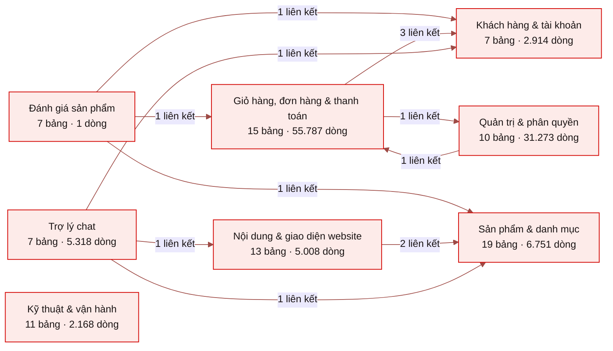

# Toàn cảnh dữ liệu BigBike

89 bảng chia thành 8 nhóm nghiệp vụ. Mũi tên: nhóm phụ thuộc → nhóm được tham chiếu.

```mermaid
%%{init: {"theme":"base","themeVariables":{"fontFamily":"Inter, Segoe UI, Arial, sans-serif","fontSize":"15px","primaryColor":"#FDEBE9","primaryTextColor":"#1A1414","primaryBorderColor":"#D40A07","lineColor":"#9E4A45","textColor":"#1A1414"}}}%%
flowchart LR
  San_pham___danh_muc["Sản phẩm & danh mục<br/>19 bảng · 6.751 dòng"]
  Khach_hang["Khách hàng & tài khoản<br/>7 bảng · 2.914 dòng"]
  Don_hang["Giỏ hàng, đơn hàng & thanh toán<br/>15 bảng · 55.787 dòng"]
  Danh_gia["Đánh giá sản phẩm<br/>7 bảng · 1 dòng"]
  Noi_dung_web["Nội dung & giao diện website<br/>13 bảng · 5.008 dòng"]
  Quan_tri["Quản trị & phân quyền<br/>10 bảng · 31.273 dòng"]
  Tro_ly_chat["Trợ lý chat<br/>7 bảng · 5.318 dòng"]
  Ky_thuat["Kỹ thuật & vận hành<br/>11 bảng · 2.168 dòng"]
  Danh_gia -->|1 liên kết| Don_hang
  Danh_gia -->|1 liên kết| Khach_hang
  Danh_gia -->|1 liên kết| San_pham___danh_muc
  Don_hang -->|3 liên kết| Khach_hang
  Don_hang -->|1 liên kết| Quan_tri
  Noi_dung_web -->|2 liên kết| San_pham___danh_muc
  Quan_tri -->|1 liên kết| Don_hang
  Tro_ly_chat -->|1 liên kết| Khach_hang
  Tro_ly_chat -->|1 liên kết| Noi_dung_web
  Tro_ly_chat -->|1 liên kết| San_pham___danh_muc
  classDef grp fill:#FDEBE9,stroke:#D40A07,stroke-width:1.2px,color:#1A1414;
  class San_pham___danh_muc,Khach_hang,Don_hang,Danh_gia,Noi_dung_web,Quan_tri,Tro_ly_chat,Ky_thuat grp;
```
