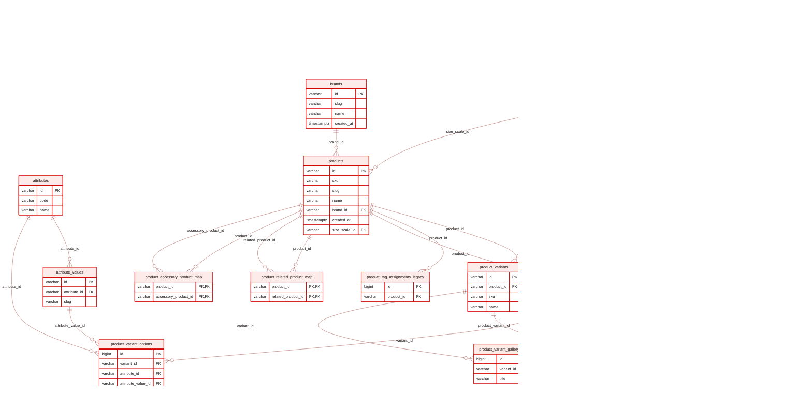

# Sản phẩm & danh mục

19 bảng · 6.751 dòng · chỉ hiện khoá chính (PK) và khoá liên kết (FK).

```mermaid
%%{init: {"theme":"base","themeVariables":{"fontFamily":"Inter, Segoe UI, Arial, sans-serif","fontSize":"14px","primaryColor":"#FDEBE9","primaryTextColor":"#1A1414","primaryBorderColor":"#D40A07","lineColor":"#9E4A45","textColor":"#1A1414","attributeBackgroundColorOdd":"#FFFFFF","attributeBackgroundColorEven":"#FAF5F4"},"er":{"layoutDirection":"LR","entityPadding":12,"diagramPadding":16}}}%%
erDiagram
  attribute_values {
    varchar id PK
    varchar attribute_id FK
    varchar slug
  }
  attributes {
    varchar id PK
    varchar code
    varchar name
  }
  brands {
    varchar id PK
    varchar slug
    varchar name
    timestamptz created_at
  }
  catalog_size_groups {
    varchar id PK
  }
  catalog_size_scales {
    varchar id PK
    varchar code
    varchar name
    varchar group_id FK
  }
  catalog_size_values {
    varchar id PK
    varchar scale_id FK
  }
  catalog_visual_alias_mappings {
    varchar alias_key PK
    varchar facet_type PK, FK
    varchar facet_key PK, FK
  }
  catalog_visual_facets {
    varchar facet_type PK
    varchar facet_key PK
  }
  categories {
    varchar id PK
    varchar slug
    varchar name
    varchar parent_id FK
    timestamptz created_at
  }
  legacy_discontinued_products {
    uuid id PK
    varchar slug
    varchar name
    timestamp created_at
  }
  product_accessory_product_map {
    varchar product_id PK, FK
    varchar accessory_product_id PK, FK
  }
  product_category_map {
    varchar product_id PK, FK
    varchar category_id PK, FK
  }
  product_related_product_map {
    varchar product_id PK, FK
    varchar related_product_id PK, FK
  }
  product_tag_assignments_legacy {
    bigint id PK
    varchar product_id FK
  }
  product_variant_gallery_images {
    bigint id PK
    varchar variant_id FK
    varchar title
  }
  product_variant_options {
    bigint id PK
    varchar variant_id FK
    varchar attribute_id FK
    varchar attribute_value_id FK
  }
  product_variants {
    varchar id PK
    varchar product_id FK
    varchar sku
    varchar name
  }
  products {
    varchar id PK
    varchar sku
    varchar slug
    varchar name
    varchar brand_id FK
    timestamptz created_at
    varchar size_scale_id FK
  }
  stock_movements {
    uuid id PK
    varchar product_variant_id FK
    timestamptz created_at
  }
  categories ||--o{ categories : "parent_id"
  brands ||--o{ products : "brand_id"
  products ||--o{ product_variants : "product_id"
  product_variants ||--o{ product_variant_options : "variant_id"
  products ||--o{ product_tag_assignments_legacy : "product_id"
  attributes ||--o{ attribute_values : "attribute_id"
  attributes ||--o{ product_variant_options : "attribute_id"
  attribute_values ||--o{ product_variant_options : "attribute_value_id"
  products ||--o{ product_category_map : "product_id"
  product_variants ||--o{ stock_movements : "product_variant_id"
  categories ||--o{ product_category_map : "category_id"
  product_variants ||--o{ product_variant_gallery_images : "variant_id"
  catalog_visual_facets ||--o{ catalog_visual_alias_mappings : "facet_type"
  catalog_visual_facets ||--o{ catalog_visual_alias_mappings : "facet_key"
  catalog_size_groups ||--o{ catalog_size_scales : "group_id"
  catalog_size_scales ||--o{ catalog_size_values : "scale_id"
  catalog_size_scales ||--o{ products : "size_scale_id"
  products ||--o{ product_related_product_map : "product_id"
  products ||--o{ product_related_product_map : "related_product_id"
  products ||--o{ product_accessory_product_map : "product_id"
  products ||--o{ product_accessory_product_map : "accessory_product_id"
```
