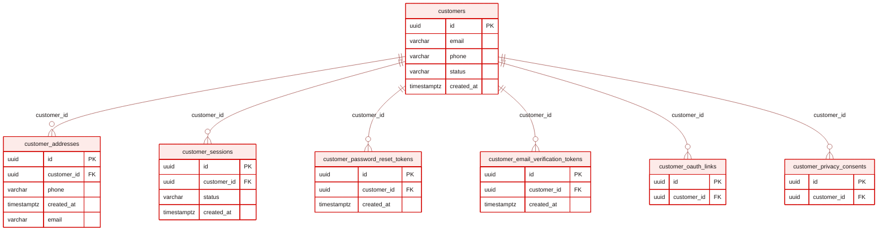

# Khách hàng & tài khoản

7 bảng · 2.914 dòng · chỉ hiện khoá chính (PK) và khoá liên kết (FK).

```mermaid
%%{init: {"theme":"base","themeVariables":{"fontFamily":"Inter, Segoe UI, Arial, sans-serif","fontSize":"14px","primaryColor":"#FDEBE9","primaryTextColor":"#1A1414","primaryBorderColor":"#D40A07","lineColor":"#9E4A45","textColor":"#1A1414","attributeBackgroundColorOdd":"#FFFFFF","attributeBackgroundColorEven":"#FAF5F4"},"er":{"layoutDirection":"LR","entityPadding":12,"diagramPadding":16}}}%%
erDiagram
  customer_addresses {
    uuid id PK
    uuid customer_id FK
    varchar phone
    timestamptz created_at
    varchar email
  }
  customer_email_verification_tokens {
    uuid id PK
    uuid customer_id FK
    timestamptz created_at
  }
  customer_oauth_links {
    uuid id PK
    uuid customer_id FK
  }
  customer_password_reset_tokens {
    uuid id PK
    uuid customer_id FK
    timestamptz created_at
  }
  customer_privacy_consents {
    uuid id PK
    uuid customer_id FK
  }
  customer_sessions {
    uuid id PK
    uuid customer_id FK
    varchar status
    timestamptz created_at
  }
  customers {
    uuid id PK
    varchar email
    varchar phone
    varchar status
    timestamptz created_at
  }
  customers ||--o{ customer_addresses : "customer_id"
  customers ||--o{ customer_sessions : "customer_id"
  customers ||--o{ customer_password_reset_tokens : "customer_id"
  customers ||--o{ customer_email_verification_tokens : "customer_id"
  customers ||--o{ customer_oauth_links : "customer_id"
  customers ||--o{ customer_privacy_consents : "customer_id"
```
