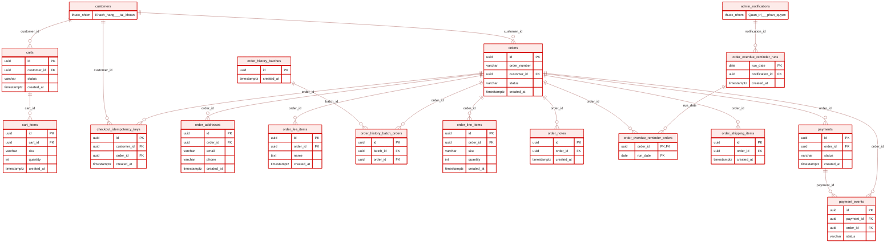

# Giỏ hàng, đơn hàng & thanh toán

15 bảng · 55.787 dòng · chỉ hiện khoá chính (PK) và khoá liên kết (FK).

```mermaid
%%{init: {"theme":"base","themeVariables":{"fontFamily":"Inter, Segoe UI, Arial, sans-serif","fontSize":"14px","primaryColor":"#FDEBE9","primaryTextColor":"#1A1414","primaryBorderColor":"#D40A07","lineColor":"#9E4A45","textColor":"#1A1414","attributeBackgroundColorOdd":"#FFFFFF","attributeBackgroundColorEven":"#FAF5F4"},"er":{"layoutDirection":"LR","entityPadding":12,"diagramPadding":16}}}%%
erDiagram
  cart_items {
    uuid id PK
    uuid cart_id FK
    varchar sku
    int quantity
    timestamptz created_at
  }
  carts {
    uuid id PK
    uuid customer_id FK
    varchar status
    timestamptz created_at
  }
  checkout_idempotency_keys {
    uuid id PK
    uuid customer_id FK
    uuid order_id FK
    timestamptz created_at
  }
  order_addresses {
    uuid id PK
    uuid order_id FK
    varchar email
    varchar phone
    timestamptz created_at
  }
  order_fee_items {
    uuid id PK
    uuid order_id FK
    text name
    timestamptz created_at
  }
  order_history_batch_orders {
    uuid id PK
    uuid batch_id FK
    uuid order_id FK
  }
  order_history_batches {
    uuid id PK
    timestamptz created_at
  }
  order_line_items {
    uuid id PK
    uuid order_id FK
    varchar sku
    int quantity
    timestamptz created_at
  }
  order_notes {
    uuid id PK
    uuid order_id FK
    timestamptz created_at
  }
  order_overdue_reminder_orders {
    uuid order_id PK, FK
    date run_date FK
  }
  order_overdue_reminder_runs {
    date run_date PK
    uuid notification_id FK
    timestamptz created_at
  }
  order_shipping_items {
    uuid id PK
    uuid order_id FK
    timestamptz created_at
  }
  orders {
    uuid id PK
    varchar order_number
    uuid customer_id FK
    varchar status
    timestamptz created_at
  }
  payment_events {
    uuid id PK
    uuid payment_id FK
    uuid order_id FK
    varchar status
  }
  payments {
    uuid id PK
    uuid order_id FK
    varchar status
    timestamptz created_at
  }
  admin_notifications {
    thuoc_nhom Quan_tri___phan_quyen
  }
  customers {
    thuoc_nhom Khach_hang___tai_khoan
  }
  customers ||--o{ carts : "customer_id"
  carts ||--o{ cart_items : "cart_id"
  customers ||--o{ orders : "customer_id"
  orders ||--o{ order_line_items : "order_id"
  orders ||--o{ order_shipping_items : "order_id"
  orders ||--o{ order_fee_items : "order_id"
  orders ||--o{ order_addresses : "order_id"
  orders ||--o{ order_notes : "order_id"
  orders ||--o{ payments : "order_id"
  payments ||--o{ payment_events : "payment_id"
  orders ||--o{ payment_events : "order_id"
  customers ||--o{ checkout_idempotency_keys : "customer_id"
  orders ||--o{ checkout_idempotency_keys : "order_id"
  order_history_batches ||--o{ order_history_batch_orders : "batch_id"
  orders ||--o{ order_history_batch_orders : "order_id"
  admin_notifications ||--o{ order_overdue_reminder_runs : "notification_id"
  orders ||--o{ order_overdue_reminder_orders : "order_id"
  order_overdue_reminder_runs ||--o{ order_overdue_reminder_orders : "run_date"
```
