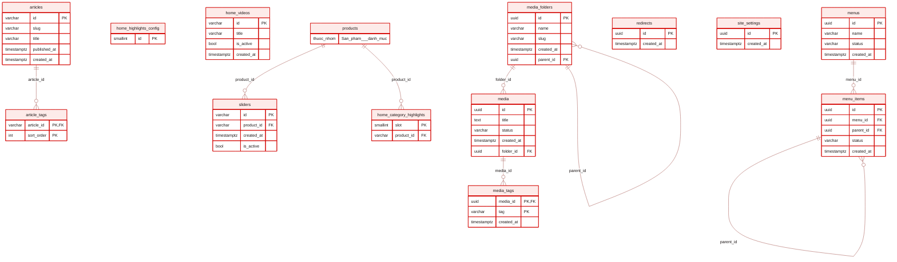

# Nội dung & giao diện website

13 bảng · 5.008 dòng · chỉ hiện khoá chính (PK) và khoá liên kết (FK).

```mermaid
%%{init: {"theme":"base","themeVariables":{"fontFamily":"Inter, Segoe UI, Arial, sans-serif","fontSize":"14px","primaryColor":"#FDEBE9","primaryTextColor":"#1A1414","primaryBorderColor":"#D40A07","lineColor":"#9E4A45","textColor":"#1A1414","attributeBackgroundColorOdd":"#FFFFFF","attributeBackgroundColorEven":"#FAF5F4"},"er":{"layoutDirection":"LR","entityPadding":12,"diagramPadding":16}}}%%
erDiagram
  article_tags {
    varchar article_id PK, FK
    int sort_order PK
  }
  articles {
    varchar id PK
    varchar slug
    varchar title
    timestamptz published_at
    timestamptz created_at
  }
  home_category_highlights {
    smallint slot PK
    varchar product_id FK
  }
  home_highlights_config {
    smallint id PK
  }
  home_videos {
    varchar id PK
    varchar title
    bool is_active
    timestamptz created_at
  }
  media {
    uuid id PK
    text title
    varchar status
    timestamptz created_at
    uuid folder_id FK
  }
  media_folders {
    uuid id PK
    varchar name
    varchar slug
    timestamptz created_at
    uuid parent_id FK
  }
  media_tags {
    uuid media_id PK, FK
    varchar tag PK
    timestamptz created_at
  }
  menu_items {
    uuid id PK
    uuid menu_id FK
    uuid parent_id FK
    varchar status
    timestamptz created_at
  }
  menus {
    uuid id PK
    varchar name
    varchar status
    timestamptz created_at
  }
  redirects {
    uuid id PK
    timestamptz created_at
  }
  site_settings {
    uuid id PK
    timestamptz created_at
  }
  sliders {
    varchar id PK
    varchar product_id FK
    timestamptz created_at
    bool is_active
  }
  products {
    thuoc_nhom San_pham___danh_muc
  }
  articles ||--o{ article_tags : "article_id"
  menus ||--o{ menu_items : "menu_id"
  menu_items ||--o{ menu_items : "parent_id"
  products ||--o{ sliders : "product_id"
  media ||--o{ media_tags : "media_id"
  media_folders ||--o{ media : "folder_id"
  products ||--o{ home_category_highlights : "product_id"
  media_folders ||--o{ media_folders : "parent_id"
```
