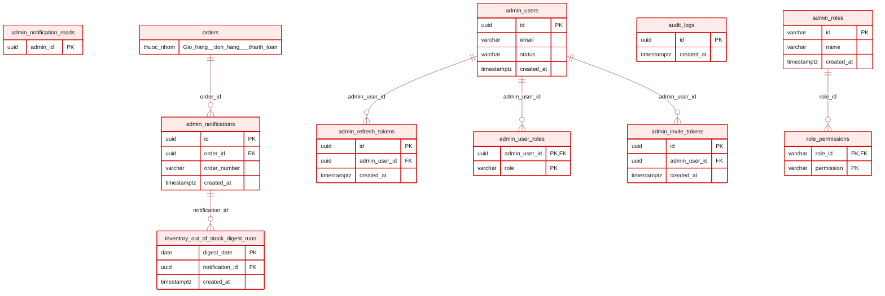

# Quản trị & phân quyền

10 bảng · 31.273 dòng · chỉ hiện khoá chính (PK) và khoá liên kết (FK).

```mermaid
%%{init: {"theme":"base","themeVariables":{"fontFamily":"Inter, Segoe UI, Arial, sans-serif","fontSize":"14px","primaryColor":"#FDEBE9","primaryTextColor":"#1A1414","primaryBorderColor":"#D40A07","lineColor":"#9E4A45","textColor":"#1A1414","attributeBackgroundColorOdd":"#FFFFFF","attributeBackgroundColorEven":"#FAF5F4"},"er":{"layoutDirection":"LR","entityPadding":12,"diagramPadding":16}}}%%
erDiagram
  admin_invite_tokens {
    uuid id PK
    uuid admin_user_id FK
    timestamptz created_at
  }
  admin_notification_reads {
    uuid admin_id PK
  }
  admin_notifications {
    uuid id PK
    uuid order_id FK
    varchar order_number
    timestamptz created_at
  }
  admin_refresh_tokens {
    uuid id PK
    uuid admin_user_id FK
    timestamptz created_at
  }
  admin_roles {
    varchar id PK
    varchar name
    timestamptz created_at
  }
  admin_user_roles {
    uuid admin_user_id PK, FK
    varchar role PK
  }
  admin_users {
    uuid id PK
    varchar email
    varchar status
    timestamptz created_at
  }
  audit_logs {
    uuid id PK
    timestamptz created_at
  }
  inventory_out_of_stock_digest_runs {
    date digest_date PK
    uuid notification_id FK
    timestamptz created_at
  }
  role_permissions {
    varchar role_id PK, FK
    varchar permission PK
  }
  orders {
    thuoc_nhom Gio_hang__don_hang___thanh_toan
  }
  admin_users ||--o{ admin_refresh_tokens : "admin_user_id"
  admin_users ||--o{ admin_user_roles : "admin_user_id"
  admin_roles ||--o{ role_permissions : "role_id"
  orders ||--o{ admin_notifications : "order_id"
  admin_users ||--o{ admin_invite_tokens : "admin_user_id"
  admin_notifications ||--o{ inventory_out_of_stock_digest_runs : "notification_id"
```
