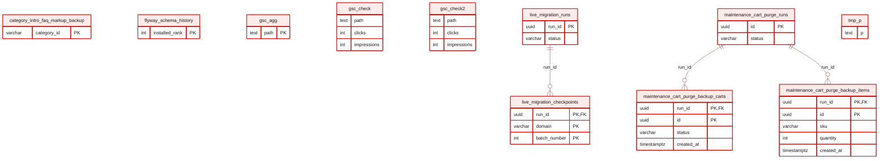

# Kỹ thuật & vận hành

11 bảng · 2.168 dòng · chỉ hiện khoá chính (PK) và khoá liên kết (FK).

```mermaid
%%{init: {"theme":"base","themeVariables":{"fontFamily":"Inter, Segoe UI, Arial, sans-serif","fontSize":"14px","primaryColor":"#FDEBE9","primaryTextColor":"#1A1414","primaryBorderColor":"#D40A07","lineColor":"#9E4A45","textColor":"#1A1414","attributeBackgroundColorOdd":"#FFFFFF","attributeBackgroundColorEven":"#FAF5F4"},"er":{"layoutDirection":"LR","entityPadding":12,"diagramPadding":16}}}%%
erDiagram
  category_intro_faq_markup_backup {
    varchar category_id PK
  }
  flyway_schema_history {
    int installed_rank PK
  }
  gsc_agg {
    text path PK
  }
  gsc_check {
    text path
    int clicks
    int impressions
  }
  gsc_check2 {
    text path
    int clicks
    int impressions
  }
  live_migration_checkpoints {
    uuid run_id PK, FK
    varchar domain PK
    int batch_number PK
  }
  live_migration_runs {
    uuid run_id PK
    varchar status
  }
  maintenance_cart_purge_backup_carts {
    uuid run_id PK, FK
    uuid id PK
    varchar status
    timestamptz created_at
  }
  maintenance_cart_purge_backup_items {
    uuid run_id PK, FK
    uuid id PK
    varchar sku
    int quantity
    timestamptz created_at
  }
  maintenance_cart_purge_runs {
    uuid id PK
    varchar status
  }
  tmp_p {
    text p
  }
  live_migration_runs ||--o{ live_migration_checkpoints : "run_id"
  maintenance_cart_purge_runs ||--o{ maintenance_cart_purge_backup_carts : "run_id"
  maintenance_cart_purge_runs ||--o{ maintenance_cart_purge_backup_items : "run_id"
```
