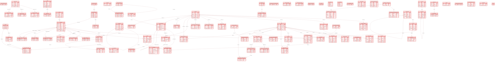

# Toàn bộ hệ thống trong một sơ đồ

Đủ 89 bảng và 77 liên kết. Sơ đồ rất lớn, trình duyệt có thể mất vài giây để vẽ - dùng các file theo nhóm nếu chỉ cần một mảng.

```mermaid
%%{init: {"theme":"base","themeVariables":{"fontFamily":"Inter, Segoe UI, Arial, sans-serif","fontSize":"14px","primaryColor":"#FDEBE9","primaryTextColor":"#1A1414","primaryBorderColor":"#D40A07","lineColor":"#9E4A45","textColor":"#1A1414","attributeBackgroundColorOdd":"#FFFFFF","attributeBackgroundColorEven":"#FAF5F4"},"er":{"layoutDirection":"LR","entityPadding":12,"diagramPadding":16}}}%%
erDiagram
  admin_invite_tokens {
    uuid id PK
    uuid admin_user_id FK
    timestamptz created_at
  }
  admin_notification_reads {
    uuid admin_id PK
  }
  admin_notifications {
    uuid id PK
    uuid order_id FK
    varchar order_number
    timestamptz created_at
  }
  admin_refresh_tokens {
    uuid id PK
    uuid admin_user_id FK
    timestamptz created_at
  }
  admin_roles {
    varchar id PK
    varchar name
    timestamptz created_at
  }
  admin_user_roles {
    uuid admin_user_id PK, FK
    varchar role PK
  }
  admin_users {
    uuid id PK
    varchar email
    varchar status
    timestamptz created_at
  }
  article_tags {
    varchar article_id PK, FK
    int sort_order PK
  }
  articles {
    varchar id PK
    varchar slug
    varchar title
    timestamptz published_at
    timestamptz created_at
  }
  attribute_values {
    varchar id PK
    varchar attribute_id FK
    varchar slug
  }
  attributes {
    varchar id PK
    varchar code
    varchar name
  }
  audit_logs {
    uuid id PK
    timestamptz created_at
  }
  brands {
    varchar id PK
    varchar slug
    varchar name
    timestamptz created_at
  }
  cart_items {
    uuid id PK
    uuid cart_id FK
    varchar sku
    int quantity
    timestamptz created_at
  }
  carts {
    uuid id PK
    uuid customer_id FK
    varchar status
    timestamptz created_at
  }
  catalog_size_groups {
    varchar id PK
  }
  catalog_size_scales {
    varchar id PK
    varchar code
    varchar name
    varchar group_id FK
  }
  catalog_size_values {
    varchar id PK
    varchar scale_id FK
  }
  catalog_visual_alias_mappings {
    varchar alias_key PK
    varchar facet_type PK, FK
    varchar facet_key PK, FK
  }
  catalog_visual_facets {
    varchar facet_type PK
    varchar facet_key PK
  }
  categories {
    varchar id PK
    varchar slug
    varchar name
    varchar parent_id FK
    timestamptz created_at
  }
  category_intro_faq_markup_backup {
    varchar category_id PK
  }
  chat_ai_daily_usage {
    date usage_date PK
    timestamptz created_at
  }
  chat_conversations {
    uuid id PK
    uuid customer_id FK
    timestamptz created_at
    uuid continued_from_id FK
    uuid visitor_id FK
  }
  chat_image_daily_usage {
    date usage_date PK
    timestamptz created_at
  }
  chat_images {
    uuid id PK
    uuid conversation_id FK
    uuid customer_message_id FK
    varchar status
    timestamptz created_at
  }
  chat_messages {
    uuid id PK
    uuid conversation_id FK
    timestamptz created_at
  }
  chat_product_image_fingerprints {
    uuid id PK
    varchar product_id FK
    uuid media_id FK
  }
  chat_visitors {
    uuid id PK
    timestamptz created_at
  }
  checkout_idempotency_keys {
    uuid id PK
    uuid customer_id FK
    uuid order_id FK
    timestamptz created_at
  }
  customer_addresses {
    uuid id PK
    uuid customer_id FK
    varchar phone
    timestamptz created_at
    varchar email
  }
  customer_email_verification_tokens {
    uuid id PK
    uuid customer_id FK
    timestamptz created_at
  }
  customer_oauth_links {
    uuid id PK
    uuid customer_id FK
  }
  customer_password_reset_tokens {
    uuid id PK
    uuid customer_id FK
    timestamptz created_at
  }
  customer_privacy_consents {
    uuid id PK
    uuid customer_id FK
  }
  customer_sessions {
    uuid id PK
    uuid customer_id FK
    varchar status
    timestamptz created_at
  }
  customers {
    uuid id PK
    varchar email
    varchar phone
    varchar status
    timestamptz created_at
  }
  flyway_schema_history {
    int installed_rank PK
  }
  gsc_agg {
    text path PK
  }
  gsc_check {
    text path
    int clicks
    int impressions
  }
  gsc_check2 {
    text path
    int clicks
    int impressions
  }
  home_category_highlights {
    smallint slot PK
    varchar product_id FK
  }
  home_highlights_config {
    smallint id PK
  }
  home_videos {
    varchar id PK
    varchar title
    bool is_active
    timestamptz created_at
  }
  inventory_out_of_stock_digest_runs {
    date digest_date PK
    uuid notification_id FK
    timestamptz created_at
  }
  legacy_discontinued_products {
    uuid id PK
    varchar slug
    varchar name
    timestamp created_at
  }
  live_migration_checkpoints {
    uuid run_id PK, FK
    varchar domain PK
    int batch_number PK
  }
  live_migration_runs {
    uuid run_id PK
    varchar status
  }
  maintenance_cart_purge_backup_carts {
    uuid run_id PK, FK
    uuid id PK
    varchar status
    timestamptz created_at
  }
  maintenance_cart_purge_backup_items {
    uuid run_id PK, FK
    uuid id PK
    varchar sku
    int quantity
    timestamptz created_at
  }
  maintenance_cart_purge_runs {
    uuid id PK
    varchar status
  }
  media {
    uuid id PK
    text title
    varchar status
    timestamptz created_at
    uuid folder_id FK
  }
  media_folders {
    uuid id PK
    varchar name
    varchar slug
    timestamptz created_at
    uuid parent_id FK
  }
  media_tags {
    uuid media_id PK, FK
    varchar tag PK
    timestamptz created_at
  }
  menu_items {
    uuid id PK
    uuid menu_id FK
    uuid parent_id FK
    varchar status
    timestamptz created_at
  }
  menus {
    uuid id PK
    varchar name
    varchar status
    timestamptz created_at
  }
  order_addresses {
    uuid id PK
    uuid order_id FK
    varchar email
    varchar phone
    timestamptz created_at
  }
  order_fee_items {
    uuid id PK
    uuid order_id FK
    text name
    timestamptz created_at
  }
  order_history_batch_orders {
    uuid id PK
    uuid batch_id FK
    uuid order_id FK
  }
  order_history_batches {
    uuid id PK
    timestamptz created_at
  }
  order_line_items {
    uuid id PK
    uuid order_id FK
    varchar sku
    int quantity
    timestamptz created_at
  }
  order_notes {
    uuid id PK
    uuid order_id FK
    timestamptz created_at
  }
  order_overdue_reminder_orders {
    uuid order_id PK, FK
    date run_date FK
  }
  order_overdue_reminder_runs {
    date run_date PK
    uuid notification_id FK
    timestamptz created_at
  }
  order_shipping_items {
    uuid id PK
    uuid order_id FK
    timestamptz created_at
  }
  orders {
    uuid id PK
    varchar order_number
    uuid customer_id FK
    varchar status
    timestamptz created_at
  }
  payment_events {
    uuid id PK
    uuid payment_id FK
    uuid order_id FK
    varchar status
  }
  payments {
    uuid id PK
    uuid order_id FK
    varchar status
    timestamptz created_at
  }
  product_accessory_product_map {
    varchar product_id PK, FK
    varchar accessory_product_id PK, FK
  }
  product_category_map {
    varchar product_id PK, FK
    varchar category_id PK, FK
  }
  product_related_product_map {
    varchar product_id PK, FK
    varchar related_product_id PK, FK
  }
  product_tag_assignments_legacy {
    bigint id PK
    varchar product_id FK
  }
  product_variant_gallery_images {
    bigint id PK
    varchar variant_id FK
    varchar title
  }
  product_variant_options {
    bigint id PK
    varchar variant_id FK
    varchar attribute_id FK
    varchar attribute_value_id FK
  }
  product_variants {
    varchar id PK
    varchar product_id FK
    varchar sku
    varchar name
  }
  products {
    varchar id PK
    varchar sku
    varchar slug
    varchar name
    varchar brand_id FK
    timestamptz created_at
    varchar size_scale_id FK
  }
  redirects {
    uuid id PK
    timestamptz created_at
  }
  review_invitation_campaigns {
    uuid id PK
    timestamptz created_at
  }
  review_invitation_daily_quotas {
    date send_date PK
  }
  review_invitation_deliveries {
    uuid id PK
    uuid campaign_id FK
    uuid order_id FK
    varchar order_number
    varchar status
    timestamptz created_at
  }
  review_invitation_items {
    uuid id PK
    uuid delivery_id FK
    bigint review_id FK
    timestamptz created_at
  }
  review_invitation_opt_outs {
    uuid id PK
    varchar email
    timestamptz created_at
  }
  review_photo_uploads {
    varchar object_key PK
    bigint review_id FK
  }
  reviews {
    bigint id PK
    varchar product_id FK
    uuid customer_id FK
    varchar status
    timestamptz created_at
  }
  role_permissions {
    varchar role_id PK, FK
    varchar permission PK
  }
  site_settings {
    uuid id PK
    timestamptz created_at
  }
  sliders {
    varchar id PK
    varchar product_id FK
    timestamptz created_at
    bool is_active
  }
  stock_movements {
    uuid id PK
    varchar product_variant_id FK
    timestamptz created_at
  }
  tmp_p {
    text p
  }
  categories ||--o{ categories : "parent_id"
  brands ||--o{ products : "brand_id"
  products ||--o{ product_variants : "product_id"
  product_variants ||--o{ product_variant_options : "variant_id"
  chat_conversations ||--o{ chat_images : "conversation_id"
  chat_messages ||--o{ chat_images : "customer_message_id"
  articles ||--o{ article_tags : "article_id"
  admin_users ||--o{ admin_refresh_tokens : "admin_user_id"
  customers ||--o{ customer_addresses : "customer_id"
  chat_conversations ||--o{ chat_messages : "conversation_id"
  products ||--o{ chat_product_image_fingerprints : "product_id"
  media ||--o{ chat_product_image_fingerprints : "media_id"
  menus ||--o{ menu_items : "menu_id"
  menu_items ||--o{ menu_items : "parent_id"
  customers ||--o{ carts : "customer_id"
  carts ||--o{ cart_items : "cart_id"
  customers ||--o{ orders : "customer_id"
  orders ||--o{ order_line_items : "order_id"
  orders ||--o{ order_shipping_items : "order_id"
  orders ||--o{ order_fee_items : "order_id"
  orders ||--o{ order_addresses : "order_id"
  orders ||--o{ order_notes : "order_id"
  orders ||--o{ payments : "order_id"
  payments ||--o{ payment_events : "payment_id"
  orders ||--o{ payment_events : "order_id"
  customers ||--o{ customer_sessions : "customer_id"
  customers ||--o{ customer_password_reset_tokens : "customer_id"
  customers ||--o{ customer_email_verification_tokens : "customer_id"
  admin_users ||--o{ admin_user_roles : "admin_user_id"
  products ||--o{ product_tag_assignments_legacy : "product_id"
  products ||--o{ reviews : "product_id"
  customers ||--o{ reviews : "customer_id"
  attributes ||--o{ attribute_values : "attribute_id"
  attributes ||--o{ product_variant_options : "attribute_id"
  attribute_values ||--o{ product_variant_options : "attribute_value_id"
  products ||--o{ sliders : "product_id"
  products ||--o{ product_category_map : "product_id"
  product_variants ||--o{ stock_movements : "product_variant_id"
  categories ||--o{ product_category_map : "category_id"
  product_variants ||--o{ product_variant_gallery_images : "variant_id"
  admin_roles ||--o{ role_permissions : "role_id"
  customers ||--o{ checkout_idempotency_keys : "customer_id"
  orders ||--o{ checkout_idempotency_keys : "order_id"
  media ||--o{ media_tags : "media_id"
  reviews ||--o{ review_photo_uploads : "review_id"
  media_folders ||--o{ media : "folder_id"
  catalog_visual_facets ||--o{ catalog_visual_alias_mappings : "facet_type"
  catalog_visual_facets ||--o{ catalog_visual_alias_mappings : "facet_key"
  order_history_batches ||--o{ order_history_batch_orders : "batch_id"
  orders ||--o{ order_history_batch_orders : "order_id"
  customers ||--o{ customer_oauth_links : "customer_id"
  catalog_size_groups ||--o{ catalog_size_scales : "group_id"
  catalog_size_scales ||--o{ catalog_size_values : "scale_id"
  catalog_size_scales ||--o{ products : "size_scale_id"
  live_migration_runs ||--o{ live_migration_checkpoints : "run_id"
  orders ||--o{ admin_notifications : "order_id"
  products ||--o{ product_related_product_map : "product_id"
  products ||--o{ product_related_product_map : "related_product_id"
  products ||--o{ home_category_highlights : "product_id"
  admin_users ||--o{ admin_invite_tokens : "admin_user_id"
  products ||--o{ product_accessory_product_map : "product_id"
  products ||--o{ product_accessory_product_map : "accessory_product_id"
  customers ||--o{ chat_conversations : "customer_id"
  chat_conversations ||--o{ chat_conversations : "continued_from_id"
  customers ||--o{ customer_privacy_consents : "customer_id"
  admin_notifications ||--o{ inventory_out_of_stock_digest_runs : "notification_id"
  maintenance_cart_purge_runs ||--o{ maintenance_cart_purge_backup_carts : "run_id"
  maintenance_cart_purge_runs ||--o{ maintenance_cart_purge_backup_items : "run_id"
  media_folders ||--o{ media_folders : "parent_id"
  chat_visitors ||--o{ chat_conversations : "visitor_id"
  admin_notifications ||--o{ order_overdue_reminder_runs : "notification_id"
  orders ||--o{ order_overdue_reminder_orders : "order_id"
  order_overdue_reminder_runs ||--o{ order_overdue_reminder_orders : "run_date"
  review_invitation_campaigns ||--o{ review_invitation_deliveries : "campaign_id"
  orders ||--o{ review_invitation_deliveries : "order_id"
  review_invitation_deliveries ||--o{ review_invitation_items : "delivery_id"
  reviews ||--o{ review_invitation_items : "review_id"
```
